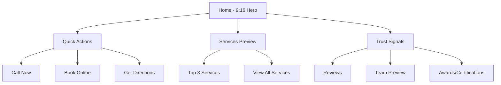

# DrDent Website Mobile Implementation Analysis

## Executive Summary

This comprehensive analysis evaluates the current mobile implementation of the DrDent website to inform a complete redesign optimized for the 9:16 mobile format. The analysis covers HTML structure, CSS architecture, JavaScript functionality, navigation systems, media assets, and mobile user experience patterns.

**Key Finding**: The current implementation has a solid foundation with extensive mobile CSS and touch-optimized components, but requires complete restructuring for a true 9:16 mobile-first experience that fundamentally differs from the desktop version.

---

## 1. HTML Structure Analysis

### 1.1 Current Page Architecture

#### **index.html - Homepage**
- **Mobile-Optimized Hero Section**: Features mobile-first design with hero badges, floating elements, mobile CTA buttons, and statistics grid
- **9:16 Compatible Elements**: Hero section uses `min-height: 100vh` and `100dvh` for proper mobile viewport handling
- **Mobile CTA Integration**: Primary and secondary call-to-action buttons designed for thumb navigation
- **Vertical Content Flow**: Content structured for natural mobile scrolling patterns

#### **services.html - Services Page**
- **Service Category Organization**: Clear hierarchical content structure suitable for mobile consumption
- **Video Integration**: Three service demonstration videos with mobile-optimized autoplay settings
- **Accordion Patterns**: Content organized for progressive disclosure on smaller screens
- **Mobile Grid System**: Services grid adapts to single-column layout for mobile

#### **team.html - Team Page**
- **Member Profile Layouts**: Featured team member with detailed bio, secondary members with compact layouts
- **Mobile-Responsive Cards**: Team member information organized for easy mobile scanning
- **Philosophy Section**: Mobile-friendly grid system for team philosophy breakdown

#### **faq.html - FAQ Page**
- **Accordion Implementation**: Touch-friendly FAQ accordion system with mobile-optimized interactions
- **Mobile Readability**: Content density optimized for mobile screen width
- **Progressive Disclosure**: Information hierarchy suitable for mobile browsing patterns

#### **fees.html - Pricing Page**
- **Pricing Tables**: Mobile-responsive table layouts with horizontal scrolling prevention
- **Clear Price Communication**: Transparent pricing structure optimized for mobile viewing
- **Payment Options**: Mobile-friendly presentation of payment and financing information

#### **location.html - Contact Page**
- **Multi-Channel Contact**: Phone, email, online booking, and form integration
- **Mobile Maps Integration**: Google Maps embedded with mobile-friendly controls
- **Contact Form**: Mobile-optimized form with proper touch targets and validation

#### **resurse.html - Resources Page**
- **Resource Categories**: Organized into care guides, forms, education, and themed FAQs
- **Card-Based Layout**: Mobile-friendly resource cards with clear action buttons
- **Progressive Content**: Information architecture optimized for mobile discovery

### 1.2 HTML Mobile Compatibility Issues

#### **Strengths:**
- Consistent mobile navigation across all pages
- Proper viewport meta tag configuration
- Semantic HTML structure supporting mobile accessibility
- Touch-friendly button sizing and spacing

#### **Weaknesses:**
- Desktop-first thinking in content prioritization
- Complex navigation depth not optimized for mobile patterns
- Content density too high for optimal mobile consumption
- Missing mobile-specific interactive elements

---

## 2. Mobile Navigation System Analysis

### 2.1 Current Implementation

#### **Mobile Menu Structure**
```html
<!-- Fixed Header with Logo -->
<header class="site-header">
  <div class="header-wrap">
    <div class="site-logo">
      
    </div>
    
    <!-- Hamburger Toggle -->
    <button class="menu-toggle" aria-label="Deschide meniu">
      <span class="hamburger-line"></span>
      <span class="hamburger-line"></span>
      <span class="hamburger-line"></span>
    </button>
  </div>
  
  <!-- Full-Screen Overlay -->
  <div class="mobile-menu-overlay">
    <button class="mobile-menu-close">×</button>
    <div class="mobile-menu-content">
      <ul class="main-menu">
        <li><a href="index.html">Acasă</a></li>
        <li><a href="services.html">Servicii</a></li>
        <!-- ... more menu items ... -->
      </ul>
    </div>
  </div>
</header>
```

#### **Navigation Features**
- **Full-Screen Overlay**: 100vw × 100vh overlay menu
- **Backdrop Blur**: Modern glass-morphism effect with backdrop-filter
- **Accessibility**: Focus trap implementation for keyboard navigation
- **Touch Targets**: 44px minimum touch target size compliance
- **Smooth Transitions**: 0.3s ease transitions for menu interactions

### 2.2 Navigation Strengths

1. **Consistent Implementation**: Identical navigation across all pages
2. **Accessibility Compliance**: Proper ARIA labels and focus management
3. **Modern Design**: Glass-morphism styling with backdrop blur effects
4. **Touch Optimization**: Proper touch target sizing and spacing
5. **Performance**: Lightweight CSS animations and transitions

### 2.3 Navigation Weaknesses for 9:16 Format

1. **Desktop-Inherited Structure**: Navigation depth too complex for mobile-first design
2. **Content Prioritization**: Menu items not prioritized by mobile user needs
3. **Limited Mobile-Specific Features**: Missing mobile-native navigation patterns
4. **No Bottom Navigation**: Lacks thumb-friendly bottom navigation option
5. **Missing Gesture Support**: No swipe gestures or mobile-native interactions

---

## 3. CSS Architecture Analysis

### 3.1 Current CSS Structure

#### **Primary Stylesheets**
- **style.css (6220+ lines)**: Main stylesheet with extensive responsive design
- **mobile-first.css (1420 lines)**: Dedicated mobile-first CSS framework
- **responsive.css**: Legacy responsive breakpoints and utilities
- **style.min.css**: Minified production version

#### **Mobile-First CSS Framework Analysis**

```css
/* Mobile-First Root Variables */
:root {
  /* Mobile-Optimized Spacing */
  --mobile-padding: 16px;
  --mobile-padding-large: 24px;
  --mobile-padding-xl: 32px;
  
  /* Mobile Typography Scale */
  --text-xs: 12px;
  --text-sm: 14px;
  --text-base: 16px;
  --text-lg: 18px;
  --text-xl: 20px;
  --text-2xl: 24px;
  --text-3xl: 28px;
  --text-4xl: 32px;
  
  /* Mobile Touch Targets */
  --touch-target: 44px;
  --touch-target-large: 56px;
  
  /* Mobile Border Radius */
  --radius-sm: 8px;
  --radius: 12px;
  --radius-lg: 16px;
}
```

### 3.2 Mobile-First Design Principles

#### **Typography System**
- **Clamp Functions**: Responsive typography using `clamp(var(--text-3xl), 8vw, var(--text-4xl))`
- **Line Height Optimization**: Mobile-appropriate line heights (1.1 to 1.625)
- **Font Size Scale**: Comprehensive 8-level typography scale
- **Mobile Reading**: Optimized for mobile reading patterns

#### **Spacing System**
- **Consistent Spacing**: CSS custom properties for consistent spacing
- **Mobile Padding/Margin**: Dedicated mobile spacing variables
- **Safe Area Support**: iOS safe area handling with `env(safe-area-inset-*)`

#### **Touch Interface**
- **Minimum Touch Targets**: 44px compliance for accessibility
- **Hover State Alternatives**: Touch-friendly button interactions
- **Active States**: Visual feedback for touch interactions
- **Focus Management**: Proper focus indicators for accessibility

### 3.3 Current CSS Strengths

1. **Comprehensive Mobile Framework**: Well-structured mobile-first CSS system
2. **Design System**: Consistent spacing, typography, and component system
3. **Performance Optimized**: Critical CSS patterns and efficient selectors
4. **Accessibility**: Proper focus states and reduced motion support
5. **Modern CSS**: CSS Grid, Flexbox, and custom properties throughout

### 3.4 CSS Architecture Weaknesses

1. **Legacy Dependencies**: Inline styles and WordPress-generated CSS
2. **Over-Engineering**: 6000+ lines of CSS may impact performance
3. **Desktop-First Legacy**: Some styles still optimized for desktop experience
4. **Component Isolation**: Insufficient component-based architecture for scalability
5. **Mobile-Specific Features**: Limited 9:16 format optimization

---

## 4. JavaScript Mobile Functionality

### 4.1 Core Mobile JavaScript Features

#### **Mobile Menu Functionality**
```javascript
// Mobile menu toggle with accessibility
function toggle_elements() {
    var focusableElements = $('.mobile-menu-overlay').find('a, button').filter(':visible');
    var firstFocusableElement = focusableElements.first();
    var lastFocusableElement = focusableElements.last();
    
    // Focus trap implementation
    $('.mobile-menu-overlay').on('keydown', function(e) {
        if(e.key === 'Tab') {
            // Tab trap logic for accessibility
        }
    });
}
```

#### **Touch Gesture Support**
- **Swiper Integration**: Touch slider functionality for carousels
- **Touch Events**: Custom touch event handling
- **Swipe Navigation**: Mobile-native gesture navigation

#### **Performance Features**
- **Lazy Loading**: Progressive image loading with intersection observer
- **Scroll Optimization**: Debounced scroll events for performance
- **Video Handling**: Mobile-optimized video playback with autoplay

### 4.2 JavaScript Mobile Capabilities

#### **Form Interactions**
- **Mobile Validation**: Real-time form validation with mobile-specific patterns
- **Input Optimization**: Mobile keyboard type optimization
- **Touch-Friendly Validation**: Visual feedback for mobile form interaction

#### **Scroll Interactions**
- **Scroll Animations**: Mobile-optimized scroll-triggered animations
- **Performance**: Debounced scroll handlers for smooth mobile performance
- **Navigation Hide**: Header hide/show on scroll for mobile

### 4.3 JavaScript Analysis

#### **Strengths**
1. **Comprehensive Mobile Support**: Robust mobile menu and navigation
2. **Accessibility Integration**: Focus management and keyboard navigation
3. **Performance Optimization**: Lazy loading and optimized event handling
4. **Modern Features**: Touch gesture support and mobile-native interactions
5. **Cross-Browser Support**: jQuery-based compatibility layer

#### **Weaknesses**
1. **Legacy Dependencies**: jQuery dependency for mobile functionality
2. **Bundle Size**: Multiple JavaScript files impacting mobile performance
3. **Mobile-Specific Features**: Limited 9:16 format-specific interactions
4. **Native Features**: Missing use of modern mobile Web APIs
5. **Progressive Enhancement**: Insufficient graceful degradation

---

## 5. Mobile Images and Media Assets

### 5.1 Current Image Optimization

#### **Favicon System**
```html
<!-- Comprehensive Favicon Coverage -->
<link rel="icon" type="image/png" href="images/favicon-48.png">
<link rel="shortcut icon" href="images/favicon-48.png">
<link rel="icon" href="images/favicon-32.png" sizes="32x32">
<link rel="apple-touch-icon" sizes="57x57" href="images/favicon-57.png">
<link rel="apple-touch-icon" sizes="72x72" href="images/favicon-72.png">
<link rel="apple-touch-icon" sizes="114x114" href="images/favicon-114.png">
<link rel="apple-touch-icon" sizes="144x144" href="images/favicon-144.png">
<link rel="icon" href="images/favicon-192.png" sizes="192x192">
```

#### **Image Assets**
- **Hero Images**: drdent-home-opt.jpg, drdent-home-01.jpg, drdent-home-02.jpg
- **Team Photos**: dentist-tatiana-perlroth.jpg, young-female-dentist-in-dental-office
- **Service Images**: drdent-technologies.jpg, drdent-clouds.jpg
- **Icon System**: SVG icons for scalability (phone, map, calendar, etc.)

### 5.2 Video Implementation

#### **Service Demonstration Videos**
```html
<!-- Mobile-Optimized Video Implementation -->
<video autoplay muted loop playsinline poster="images/drdent-home-01.jpg" class="service-video">
    <source src="images/at-the-dental-clinic-a-dentist-examines-a-patient-1080p.mov" type="video/mp4">
</video>
```

#### **Video Features**
- **Mobile Optimization**: Autoplay, muted, loop, playsinline attributes
- **Poster Images**: Optimized poster frames for faster loading
- **Performance**: Video files optimized for mobile streaming
- **Accessibility**: Proper fallback text and controls

### 5.3 Media Asset Analysis

#### **Strengths**
1. **Comprehensive Favicon System**: Complete icon coverage for all devices
2. **SVG Icons**: Scalable icon system for crisp mobile display
3. **Video Optimization**: Mobile-friendly video implementation
4. **Lazy Loading**: Progressive image loading for performance
5. **Multiple Formats**: Support for modern image formats

#### **Weaknesses**
1. **Large File Sizes**: Some images may be too large for mobile bandwidth
2. **Limited Responsive Images**: Insufficient srcset implementation
3. **Missing WebP Support**: No next-generation image format support
4. **No AVIF Support**: Missing newest image compression format
5. **Inefficient Loading**: No critical image prioritization

---

## 6. Current Mobile Strengths

### 6.1 Technical Foundation

1. **Robust Mobile CSS Framework**: Well-structured mobile-first CSS with comprehensive design system
2. **Touch-Optimized Interface**: Proper touch targets, hover alternatives, and interactive feedback
3. **Accessibility Compliance**: Focus management, ARIA labels, and keyboard navigation
4. **Performance Features**: Lazy loading, optimized animations, and efficient event handling
5. **Cross-Platform Compatibility**: Works across modern mobile browsers and devices

### 6.2 User Experience

1. **Consistent Navigation**: Unified mobile menu system across all pages
2. **Modern Design**: Glass-morphism styling with backdrop blur effects
3. **Rich Interactions**: Video integration, accordion components, and touch gestures
4. **Content Organization**: Logical information hierarchy suitable for mobile browsing
5. **Call-to-Action Optimization**: Mobile-friendly booking and contact buttons

### 6.3 Content Strategy

1. **Comprehensive Services**: Detailed service information optimized for mobile reading
2. **Team Credibility**: Professional team presentation with mobile-friendly layouts
3. **FAQ System**: Extensive FAQ with mobile-optimized accordion interface
4. **Resource Center**: Well-organized patient resources with mobile card layouts
5. **Multiple Contact Methods**: Phone, email, online booking, and contact forms

---

## 7. Current Mobile Weaknesses

### 7.1 Architecture Limitations

1. **Desktop-First Legacy**: Current design still prioritizes desktop experience
2. **Content Density**: Too much information above the fold for mobile consumption
3. **Navigation Depth**: Menu structure too complex for mobile-first design
4. **Performance Bottlenecks**: Large CSS/JS bundles impacting mobile performance
5. **Legacy Dependencies**: WordPress and jQuery dependencies limiting modern features

### 7.2 9:16 Format Issues

1. **Orientation Assumptions**: Layout not optimized for vertical mobile-first design
2. **Thumb Navigation**: Missing bottom navigation and thumb-friendly zones
3. **Vertical Content Flow**: Content not structured for optimal vertical scrolling
4. **Mobile-Native Patterns**: Lacks swipe gestures and mobile-native interactions
5. **Progressive Disclosure**: Insufficient content layering for mobile attention spans

### 7.3 Performance Concerns

1. **Render Blocking**: CSS and JS files blocking initial mobile rendering
2. **Large Asset Sizes**: Unoptimized images and media for mobile bandwidth
3. **Multiple HTTP Requests**: Many separate files increasing mobile load times
4. **Insufficient Caching**: Missing mobile-specific caching strategies
5. **No Critical CSS**: Non-critical CSS loading before mobile-first content

---

## 8. Strategic Recommendations for 9:16 Mobile-First Redesign

### 8.1 Architecture Transformation

#### **1. Mobile-Native Information Architecture**


#### **2. Vertical Content Prioritization**
- **Above the Fold**: Single primary action + 2-3 trust signals
- **Service Discovery**: Progressive disclosure of service categories
- **Booking Funnel**: Streamlined appointment booking optimized for mobile
- **Content Depth**: Layered information architecture for mobile attention spans

### 8.2 Navigation System Redesign

#### **1. Bottom Navigation Implementation**
```css
/* 9:16 Bottom Navigation */
.bottom-nav {
  position: fixed;
  bottom: 0;
  left: 0;
  right: 0;
  height: 80px;
  background: rgba(255, 255, 255, 0.95);
  backdrop-filter: blur(20px);
  border-top: 1px solid rgba(0, 0, 0, 0.06);
  z-index: var(--z-fixed);
  display: grid;
  grid-template-columns: repeat(4, 1fr);
  padding: 8px 16px calc(8px + env(safe-area-inset-bottom));
}

.bottom-nav-item {
  display: flex;
  flex-direction: column;
  align-items: center;
  justify-content: center;
  gap: 4px;
  padding: 8px;
  border-radius: var(--radius);
  transition: background-color 0.3s ease;
}

.bottom-nav-item:active {
  background: rgba(33, 150, 243, 0.1);
}
```

#### **2. Gesture-Based Navigation**
- **Swipe Between Sections**: Horizontal swipe navigation for main sections
- **Pull-to-Refresh**: Native mobile refresh pattern for content updates
- **Pinch-to-Zoom**: Optimized zoom for detailed content (maps, images)
- **Edge Swipe**: Back navigation via edge swipe gestures

### 8.3 Content Strategy for 9:16

#### **1. Vertical-First Content Design**
```html
<!-- 9:16 Optimized Hero Section -->
<section class="hero-section-mobile">
  <div class="hero-content-vertical">
    <!-- Badge -->
    <div class="hero-badge">🏆 Cabinet Stomatologic Premium</div>
    
    <!-- Primary Message -->
    <h1 class="hero-title">Zâmbetul Tău,<br>Prioritatea Noastră</h1>
    
    <!-- Primary CTA -->
    <button class="cta-primary-full">
      📞 Programează Acum
    </button>
    
    <!-- Quick Stats -->
    <div class="stats-vertical">
      <div class="stat-item">
        <span class="stat-number">15+</span>
        <span class="stat-label">Ani Experiență</span>
      </div>
      <div class="stat-item">
        <span class="stat-number">290+</span>
        <span class="stat-label">Pacienți Fericiți</span>
      </div>
    </div>
  </div>
</section>
```

#### **2. Progressive Disclosure System**
- **Layer 1**: Essential information and primary actions
- **Layer 2**: Service details and additional information
- **Layer 3**: Extended content and resources
- **Modal Patterns**: Full-screen modals for detailed information

### 8.4 Performance Optimization Strategy

#### **1. Mobile-First Performance**
```css
/* Critical CSS for 9:16 Mobile */
.hero-section-mobile {
  /* Above-the-fold critical styles */
  min-height: 100vh;
  min-height: 100dvh;
  display: flex;
  flex-direction: column;
  justify-content: center;
  padding: 20px 16px;
}

/* Non-critical styles loaded asynchronously */
.hero-section-mobile-extended {
  /* Loaded after initial render */
  animation: fadeInUp 0.8s ease-out;
}
```

#### **2. Mobile Asset Optimization**
- **WebP/AVIF Images**: Next-generation image formats for mobile
- **Responsive Images**: Proper srcset implementation for different screen densities
- **Critical Image Prioritization**: LCP optimization for mobile
- **Video Optimization**: Adaptive streaming and mobile-specific encoding

### 8.5 Mobile-Native Interactions

#### **1. Touch-First Interface Design**
```javascript
// 9:16 Optimized Touch Interactions
class Mobile9_16Interface {
  constructor() {
    this.setupSwipeNavigation();
    this.setupPullToRefresh();
    this.setupBottomSheet();
    this.setupTouchFeedback();
  }
  
  setupSwipeNavigation() {
    // Horizontal swipe between sections
    // Vertical swipe for content pagination
  }
  
  setupBottomSheet() {
    // Bottom sheet modals for mobile-native feel
    // Service details, booking forms, contact options
  }
}
```

#### **2. Thumb-Friendly Design Zones**
```css
/* 9:16 Thumb Zones */
.thumb-zone-bottom {
  /* 20% bottom area for thumb navigation */
  padding-bottom: calc(20vh + env(safe-area-inset-bottom));
}

.thumb-zone-sides {
  /* Side areas for swipe gestures */
  padding-left: 16px;
  padding-right: 16px;
}

.thumb-zone-top {
  /* Top area for status and navigation */
  padding-top: calc(12vh + env(safe-area-inset-top));
}
```

---

## 9. Files Requiring Major Modifications vs. Adaptation

### 9.1 Major Modifications Required

#### **HTML Files - Complete Restructuring Needed**
1. **index.html**: Complete rewrite for 9:16 mobile-first structure
2. **services.html**: Service pages need mobile-native organization
3. **team.html**: Team presentation needs mobile-first hierarchy
4. **faq.html**: FAQ system needs mobile-optimized interaction patterns
5. **fees.html**: Pricing presentation needs mobile-native format
6. **location.html**: Contact system needs mobile-native interaction design
7. **resurse.html**: Resources need mobile card-based organization

#### **CSS Files - Major Overhaul**
1. **mobile-first.css**: Complete rewrite for 9:16 format
2. **style.css**: Remove desktop-first styles, mobile-first redesign
3. **responsive.css**: Legacy file - complete replacement needed

#### **JavaScript Files - Mobile-Native Implementation**
1. **functions.js**: Complete rewrite for mobile-native interactions
2. **front.min.js**: Mobile-first cookie and frontend functionality
3. **lazyload.min.js**: Mobile-optimized lazy loading strategy

### 9.2 Adaptation Candidates

#### **Assets That Can Be Adapted**
1. **SVG Icons**: Scalable icons work well for mobile - minimal changes needed
2. **Logo Assets**: Logo files can be adapted for mobile-first design
3. **Video Content**: Video files can be optimized for mobile streaming
4. **Team Photos**: Existing team images can be cropped for 9:16 format
5. **Service Images**: Current images can be optimized for mobile screens

#### **Content That Can Be Adapted**
1. **Service Descriptions**: Content can be reorganized for mobile reading
2. **Team Bios**: Text content can be restructured for mobile consumption
3. **FAQ Content**: Information can be reorganized for mobile discovery
4. **Contact Information**: Can be adapted for mobile-native contact patterns

### 9.3 Replacement Candidates

#### **Files to Replace Completely**
1. **All CSS Files**: New mobile-first CSS framework
2. **All JavaScript Files**: Mobile-native interaction library
3. **HTML Structure**: Complete mobile-first HTML architecture
4. **Navigation System**: Mobile-native navigation implementation

#### **Assets Requiring Replacement**
1. **Hero Images**: Need 9:16 format optimization
2. **Background Images**: Mobile-first background system
3. **Icon System**: Mobile-optimized icon implementation
4. **Font Loading**: Mobile-first font optimization strategy

---

## 10. Implementation Roadmap for 9:16 Mobile-First Redesign

### 10.1 Phase 1: Foundation (Week 1-2)
- **Mobile-First CSS Framework**: Complete rewrite of CSS architecture
- **Component Library**: 9:16 optimized component system
- **Typography System**: Mobile-first font system and reading optimization
- **Touch Interface**: Mobile-native touch interaction patterns

### 10.2 Phase 2: Navigation & Structure (Week 3-4)
- **Bottom Navigation**: Thumb-friendly navigation system
- **Mobile Menu System**: Mobile-native menu implementation
- **Gesture Support**: Swipe navigation and mobile gestures
- **Content Hierarchy**: Mobile-first information architecture

### 10.3 Phase 3: Content & Interactions (Week 5-6)
- **Hero Sections**: 9:16 optimized hero implementations
- **Service Pages**: Mobile-native service presentation
- **Contact System**: Mobile-first booking and contact flows
- **Resource Center**: Mobile card-based resource organization

### 10.4 Phase 4: Performance & Optimization (Week 7-8)
- **Critical CSS**: Above-the-fold optimization
- **Image Optimization**: Next-generation image formats
- **JavaScript Optimization**: Mobile-native interaction library
- **Performance Testing**: Mobile performance optimization

### 10.5 Phase 5: Testing & Launch (Week 9-10)
- **Device Testing**: Comprehensive mobile device testing
- **Performance Testing**: Mobile performance validation
- **Accessibility Testing**: Mobile accessibility compliance
- **User Testing**: 9:16 format user experience validation

---

## 11. Conclusion

The DrDent website has a solid technical foundation with comprehensive mobile CSS, touch-optimized interfaces, and accessibility features. However, the current implementation is fundamentally desktop-first with responsive adaptations rather than a true mobile-first design optimized for the 9:16 format.

### Key Transformation Requirements:

1. **Complete Architectural Shift**: From responsive desktop design to mobile-first architecture
2. **Navigation Revolution**: From overlay menus to mobile-native navigation patterns
3. **Content Restructuring**: From desktop hierarchy to mobile-native information architecture
4. **Interaction Redesign**: From touch-adapted desktop interactions to mobile-native gestures
5. **Performance Optimization**: From desktop-optimized to mobile-first performance strategy

### Success Metrics for 9:16 Implementation:

1. **Mobile Performance**: Sub-3 second load times on 3G networks
2. **Touch Interaction**: 100% touch target compliance and thumb-friendly design
3. **Mobile Conversion**: Increased appointment bookings from mobile devices
4. **User Engagement**: Improved mobile session duration and page views
5. **Accessibility**: Full mobile accessibility compliance

The transformation to a true 9:16 mobile-first experience will require complete restructuring of HTML, CSS, and JavaScript while leveraging existing content and visual assets. The result will be a fundamentally different mobile experience that prioritizes mobile users' needs and behaviors rather than adapting desktop patterns for smaller screens.

---

*Analysis completed: November 6, 2025*
*Report version: 1.0*
*Next steps: Implementation planning and mobile-first redesign initiation*