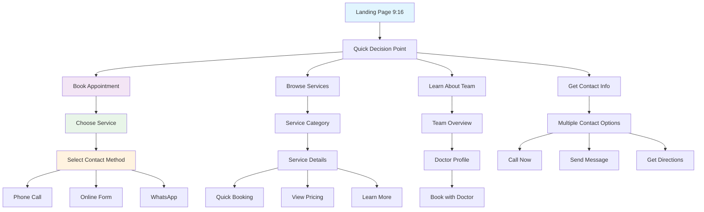
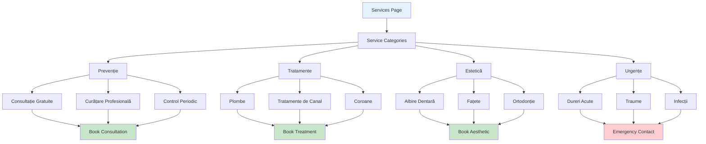
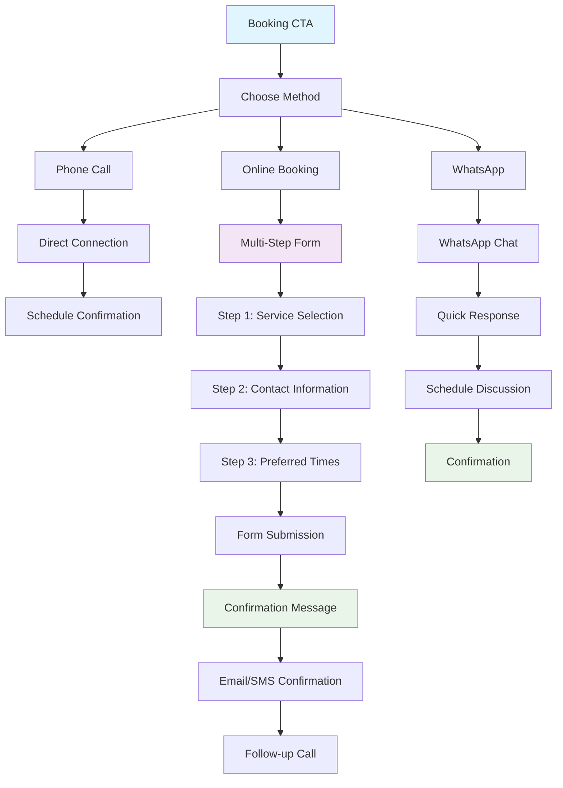
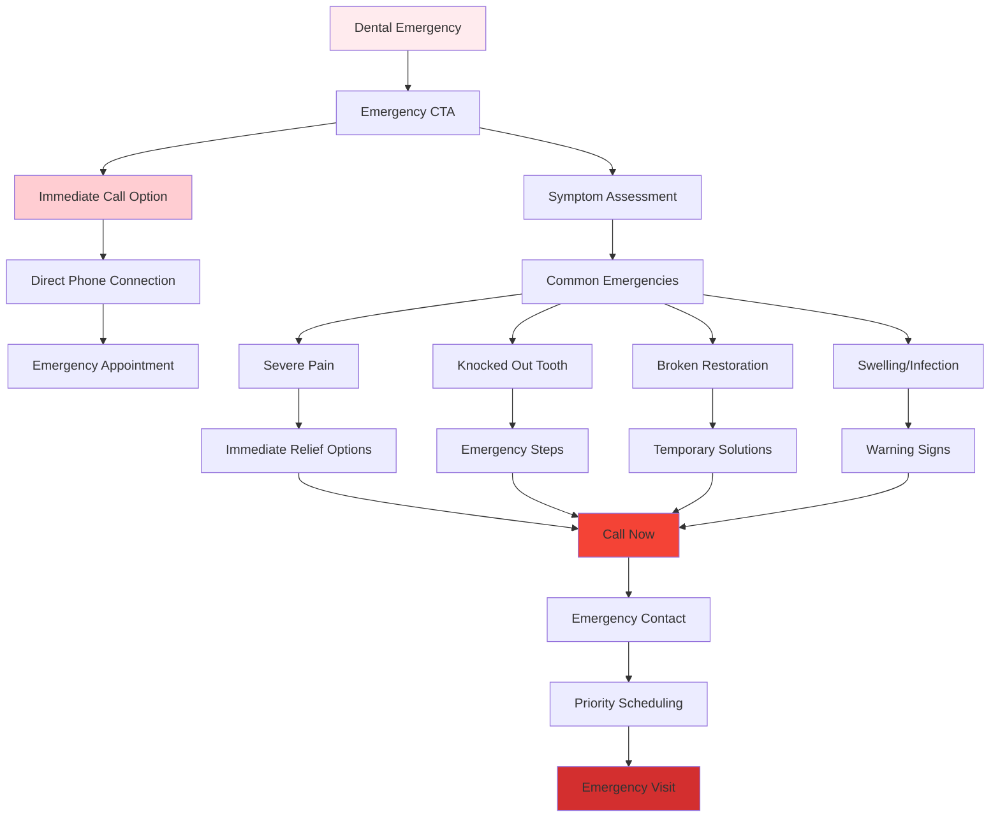
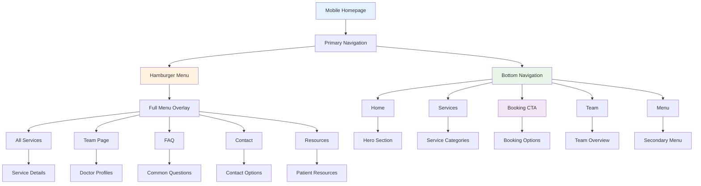

# DrDent Website Mobile-First Design Strategy
**Project:** 9:16 Format Transformation  
**Date:** November 6, 2025  
**Status:** Comprehensive Strategy Document  
**Version:** 1.0

---

## Executive Summary

This document provides a comprehensive mobile-first design strategy for transforming the DrDent website from a desktop-first responsive design into a completely native mobile experience optimized for 9:16 format (mobile portrait). The strategy addresses architectural transformation, user experience design, technical implementation, and performance optimization.

### Strategic Objectives
1. **Complete Mobile-First Architecture** - Transform from responsive desktop design to mobile-native experience
2. **9:16 Format Optimization** - Design specifically for portrait mobile viewing patterns
3. **Mobile-Native Interactions** - Implement thumb-friendly navigation and gesture-based controls
4. **Performance Excellence** - Achieve sub-3 second load times on mobile networks
5. **User Experience Excellence** - Create intuitive mobile-first information architecture

### Key Transformation Areas
- **Navigation System**: Bottom navigation with thumb-friendly zones
- **Content Hierarchy**: Vertical-first content prioritization for 9:16 format
- **Interaction Design**: Mobile-native gestures and touch patterns
- **Visual Design**: Mobile-optimized typography, spacing, and color systems
- **Performance**: Mobile-first loading strategies and optimization
- **Technical Architecture**: Complete rebuild of CSS/JS for mobile-first approach

---

## 1. Mobile-First Architectural Approach for 9:16 Format

### 1.1 Architectural Philosophy

**Current State Analysis:**
- Existing implementation: Desktop-first with responsive adaptations
- Mobile experience: Scaled-down desktop interface
- User behavior: Mobile users forced to navigate like desktop users

**Target State Vision:**
- Mobile-native design: Built from ground up for 9:16 format
- User behavior: Mobile users experience designed for their patterns
- Performance: Mobile-first loading and optimization

### 1.2 9:16 Format Design Principles

**Core Principles:**
1. **Vertical-First Design** - Content flows vertically, optimized for thumb scrolling
2. **Thumb-Native Zones** - All primary actions within comfortable thumb reach
3. **Progressive Disclosure** - Layer information based on mobile attention spans
4. **Mobile-Native Patterns** - Use familiar mobile interaction conventions
5. **Performance-First** - Optimized for mobile networks and devices

### 1.3 Mobile-First CSS Architecture

**CSS Structure Transformation:**

```css
/* Mobile-First Architecture */
/* Base styles for mobile (320px - 479px) */

:root {
  /* 9:16 Format Variables */
  --mobile-height: 100dvh; /* Dynamic viewport height */
  --mobile-width: 100vw;
  
  /* Mobile-First Spacing */
  --space-xs: 0.5rem;   /* 8px */
  --space-sm: 0.75rem;  /* 12px */
  --space-md: 1rem;     /* 16px */
  --space-lg: 1.5rem;   /* 24px */
  --space-xl: 2rem;     /* 32px */
  --space-2xl: 3rem;    /* 48px */
  
  /* Mobile Typography Scale */
  --text-xs: 0.75rem;   /* 12px */
  --text-sm: 0.875rem;  /* 14px */
  --text-base: 1rem;    /* 16px */
  --text-lg: 1.125rem;  /* 18px */
  --text-xl: 1.25rem;   /* 20px */
  --text-2xl: 1.5rem;   /* 24px */
  --text-3xl: 1.875rem; /* 30px */
  --text-4xl: 2.25rem;  /* 36px */
  
  /* Touch Targets */
  --touch-min: 44px;     /* WCAG minimum */
  --touch-comfortable: 56px;
  --touch-thumb-zone: 120px; /* Bottom thumb zone */
}

/* Base Mobile Styles (320px+) */
.container {
  width: 100%;
  padding: 0 var(--space-md);
  margin: 0 auto;
}

.hero-section {
  min-height: var(--mobile-height);
  display: flex;
  flex-direction: column;
  justify-content: center;
  padding: var(--space-xl) var(--space-md);
}

/* Mobile-Native Components */
.button-mobile {
  min-height: var(--touch-min);
  padding: var(--space-sm) var(--space-lg);
  border-radius: var(--radius);
  font-size: var(--text-base);
  font-weight: 600;
}

/* Progressive Enhancement for Larger Screens */
@media (min-width: 480px) {
  .container {
    max-width: 480px;
    padding: 0 var(--space-lg);
  }
}

@media (min-width: 768px) {
  .container {
    max-width: 768px;
  }
  
  .hero-section {
    min-height: 70vh;
  }
}
```

### 1.4 HTML Structure for 9:16 Format

**Mobile-First HTML Architecture:**

```html
<!DOCTYPE html>
<html lang="ro">
<head>
  <meta charset="UTF-8">
  <meta name="viewport" content="width=device-width, initial-scale=1.0, maximum-scale=1.0, user-scalable=no">
  <title>DrDent - Cabinet Stomatologic</title>
  
  <!-- Preload critical resources -->
  <link rel="preload" href="css/mobile-first.css" as="style">
  <link rel="preload" href="js/mobile-core.js" as="script">
  
  <!-- Mobile-First CSS -->
  <link rel="stylesheet" href="css/mobile-first.css">
  
  <!-- Progressive Enhancement CSS -->
  <link rel="stylesheet" href="css/tablet.css" media="(min-width: 768px)">
  <link rel="stylesheet" href="css/desktop.css" media="(min-width: 1024px)">
</head>
<body class="mobile-first">
  <!-- Skip to main content for accessibility -->
  <a href="#main-content" class="skip-link">Sări la conținutul principal</a>
  
  <!-- Mobile-First Header -->
  <header class="mobile-header" role="banner">
    <div class="header-container">
      <div class="logo">
        
      </div>
      
      <!-- Mobile Hamburger (Top Right for conventional patterns) -->
      <button class="menu-toggle" aria-label="Deschide meniul" aria-expanded="false">
        <span class="hamburger-line"></span>
        <span class="hamburger-line"></span>
        <span class="hamburger-line"></span>
      </button>
    </div>
  </header>
  
  <!-- Main Content Area -->
  <main id="main-content" role="main" class="main-content">
    <!-- Hero Section Optimized for 9:16 -->
    <section class="hero-mobile" id="hero">
      <div class="hero-content">
        <div class="hero-badge">🏆 Cabinet Stomatologic Premium</div>
        <h1 class="hero-title">Zâmbetul Tău,<br>Prioritatea Noastră</h1>
        <p class="hero-subtitle">
          Îngrijire dentară modernă și blândă<br>
          în inima Bucureștiului
        </p>
        
        <!-- Primary CTA - Thumb-friendly -->
        <div class="hero-actions">
          <button class="cta-primary-full" onclick="openBookingModal()">
            📅 Programați Acum
          </button>
        </div>
        
        <!-- Quick Stats for Trust -->
        <div class="hero-stats">
          <div class="stat-item">
            <span class="stat-number">15+</span>
            <span class="stat-label">Ani Experiență</span>
          </div>
          <div class="stat-item">
            <span class="stat-number">290+</span>
            <span class="stat-label">Pacienți Fericiți</span>
          </div>
        </div>
      </div>
    </section>
    
    <!-- Content Sections Optimized for Vertical Scrolling -->
    <section class="services-preview" id="services">
      <div class="section-header">
        <h2>Serviciile Noastre</h2>
        <p>Îngrijire completă pentru zâmbetul tău</p>
      </div>
      
      <!-- Mobile Card Layout -->
      <div class="services-grid-mobile">
        <article class="service-card-mobile" onclick="openServiceDetails('consultatie')">
          <div class="service-icon">🦷</div>
          <h3>Consultație</h3>
          <p>Examen complet și evaluare</p>
          <span class="service-price">Gratuit</span>
        </article>
        
        <article class="service-card-mobile" onclick="openServiceDetails('preventie')">
          <div class="service-icon">🛡️</div>
          <h3>Prevenție</h3>
          <p>Curățare și igienizare</p>
          <span class="service-price">De la 150 RON</span>
        </article>
        
        <article class="service-card-mobile" onclick="openServiceDetails('tratamente')">
          <div class="service-icon">🔧</div>
          <h3>Tratamente</h3>
          <p>Plombe și coroane</p>
          <span class="service-price">De la 200 RON</span>
        </article>
      </div>
      
      <div class="section-cta">
        <a href="services.html" class="cta-secondary">Vezi Toate Serviciile</a>
      </div>
    </section>
  </main>
  
  <!-- Bottom Navigation - Thumb-Friendly -->
  <nav class="bottom-navigation" role="navigation" aria-label="Navigare principală">
    <a href="index.html" class="bottom-nav-item active" aria-label="Acasă">
      <svg class="nav-icon"><!-- Home icon --></svg>
      <span class="nav-label">Acasă</span>
    </a>
    
    <a href="services.html" class="bottom-nav-item" aria-label="Servicii">
      <svg class="nav-icon"><!-- Services icon --></svg>
      <span class="nav-label">Servicii</span>
    </a>
    
    <button class="bottom-nav-item bottom-nav-cta" onclick="openBookingModal()" aria-label="Programare">
      <svg class="nav-icon"><!-- Calendar icon --></svg>
      <span class="nav-label">Programare</span>
    </button>
    
    <a href="team.html" class="bottom-nav-item" aria-label="Echipa">
      <svg class="nav-icon"><!-- Team icon --></svg>
      <span class="nav-label">Echipa</span>
    </a>
    
    <button class="bottom-nav-item" onclick="openMobileMenu()" aria-label="Meniu">
      <svg class="nav-icon"><!-- Menu icon --></svg>
      <span class="nav-label">Meniu</span>
    </button>
  </nav>
  
  <!-- Mobile Menu Overlay -->
  <div class="mobile-menu-overlay" id="mobileMenu">
    <div class="mobile-menu-content">
      <div class="mobile-menu-header">
        
        <button class="mobile-menu-close" onclick="closeMobileMenu()" aria-label="Închide meniul">
          ×
        </button>
      </div>
      
      <nav class="mobile-menu-nav">
        <ul class="mobile-menu-list">
          <li><a href="index.html" onclick="closeMobileMenu()">Acasă</a></li>
          <li><a href="services.html" onclick="closeMobileMenu()">Servicii</a></li>
          <li><a href="fees.html" onclick="closeMobileMenu()">Prețuri</a></li>
          <li><a href="team.html" onclick="closeMobileMenu()">Echipa</a></li>
          <li><a href="faq.html" onclick="closeMobileMenu()">Întrebări</a></li>
          <li><a href="location.html" onclick="closeMobileMenu()">Contact</a></li>
          <li><a href="resurse.html" onclick="closeMobileMenu()">Resurse</a></li>
        </ul>
      </nav>
      
      <div class="mobile-menu-footer">
        <div class="contact-info">
          <a href="tel:+40213449317" class="contact-link">📞 021 344 9317</a>
          <a href="location.html" class="contact-link">📍 Strada Aviator Popisteanu 54A</a>
        </div>
      </div>
    </div>
  </div>
  
  <!-- Mobile-First JavaScript -->
  <script src="js/mobile-core.js" defer></script>
</body>
</html>
```

---

## 2. Mobile Navigation Strategy

### 2.1 Bottom Navigation Design

**Philosophy:** Thumb-friendly, always accessible primary navigation

```css
/* Bottom Navigation System */
.bottom-navigation {
  position: fixed;
  bottom: 0;
  left: 0;
  right: 0;
  height: calc(80px + env(safe-area-inset-bottom));
  background: rgba(255, 255, 255, 0.95);
  backdrop-filter: blur(20px);
  border-top: 1px solid rgba(0, 0, 0, 0.06);
  display: grid;
  grid-template-columns: repeat(5, 1fr);
  padding: 8px 16px calc(8px + env(safe-area-inset-bottom));
  z-index: var(--z-bottom-nav);
  /* Above content but below modals */
}

.bottom-nav-item {
  display: flex;
  flex-direction: column;
  align-items: center;
  justify-content: center;
  gap: 4px;
  padding: 8px;
  border-radius: var(--radius);
  text-decoration: none;
  color: var(--text-secondary);
  font-size: var(--text-xs);
  font-weight: 500;
  transition: all 0.3s cubic-bezier(0.4, 0, 0.2, 1);
  min-height: var(--touch-min);
  position: relative;
}

.bottom-nav-item.active {
  color: var(--primary-teal);
  background: rgba(0, 180, 166, 0.1);
}

.bottom-nav-item:active {
  background: rgba(33, 150, 243, 0.1);
  transform: scale(0.95);
}

.nav-icon {
  width: 24px;
  height: 24px;
  fill: currentColor;
}

.bottom-nav-cta {
  background: var(--gradient-accent);
  color: white !important;
  border-radius: var(--radius-lg);
  padding: 12px 16px;
  margin: -4px 0;
}

.bottom-nav-cta .nav-icon {
  width: 28px;
  height: 28px;
}

/* Thumb Zone Protection */
.main-content {
  padding-bottom: calc(80px + env(safe-area-inset-bottom) + 16px);
}
```

### 2.2 Mobile Menu Overlay

**Design:** Full-screen overlay with smooth animations

```css
/* Mobile Menu Overlay */
.mobile-menu-overlay {
  position: fixed;
  inset: 0;
  background: var(--gradient-hero);
  z-index: var(--z-mobile-menu);
  transform: translateX(100%);
  transition: transform 0.4s cubic-bezier(0.4, 0, 0.2, 1);
  overflow-y: auto;
  -webkit-overflow-scrolling: touch;
}

.mobile-menu-overlay.active {
  transform: translateX(0);
}

.mobile-menu-content {
  min-height: 100%;
  padding: 24px 20px 40px;
  display: flex;
  flex-direction: column;
}

.mobile-menu-header {
  display: flex;
  justify-content: space-between;
  align-items: center;
  margin-bottom: 2rem;
}

.mobile-menu-logo {
  height: 40px;
  width: auto;
}

.mobile-menu-close {
  width: 44px;
  height: 44px;
  border: none;
  background: rgba(255, 255, 255, 0.2);
  color: white;
  border-radius: 50%;
  font-size: 24px;
  display: flex;
  align-items: center;
  justify-content: center;
}

.mobile-menu-list {
  list-style: none;
  margin: 0;
  padding: 0;
  flex: 1;
}

.mobile-menu-list li {
  margin-bottom: 1rem;
  opacity: 0;
  transform: translateX(30px);
  transition: all 0.4s cubic-bezier(0.4, 0, 0.2, 1);
}

.mobile-menu-overlay.active .mobile-menu-list li {
  opacity: 1;
  transform: translateX(0);
}

/* Stagger animation */
.mobile-menu-list li:nth-child(1) { transition-delay: 0.1s; }
.mobile-menu-list li:nth-child(2) { transition-delay: 0.15s; }
.mobile-menu-list li:nth-child(3) { transition-delay: 0.2s; }
.mobile-menu-list li:nth-child(4) { transition-delay: 0.25s; }
.mobile-menu-list li:nth-child(5) { transition-delay: 0.3s; }
.mobile-menu-list li:nth-child(6) { transition-delay: 0.35s; }

.mobile-menu-list a {
  display: block;
  padding: 16px 0;
  font-size: var(--text-xl);
  font-weight: 600;
  color: white;
  text-decoration: none;
  border-bottom: 1px solid rgba(255, 255, 255, 0.1);
}

.mobile-menu-footer {
  margin-top: 2rem;
  padding-top: 2rem;
  border-top: 1px solid rgba(255, 255, 255, 0.2);
}

.contact-link {
  display: block;
  color: white;
  text-decoration: none;
  margin-bottom: 0.5rem;
  font-size: var(--text-lg);
}
```

### 2.3 Thumb-Friendly Zone Design

```css
/* Thumb Zone Optimization */
.thumb-zone-bottom {
  /* 25% bottom area reserved for thumb navigation */
  padding-bottom: calc(25vh + env(safe-area-inset-bottom));
}

.thumb-zone-sides {
  /* Comfortable side margins */
  padding-left: var(--space-md);
  padding-right: var(--space-md);
}

.thumb-zone-top {
  /* Status bar and header area */
  padding-top: calc(var(--header-height) + env(safe-area-inset-top));
}

/* Comfortable Reach Areas */
.comfortable-reach {
  /* Primary actions in thumb-friendly zones */
  margin: 16px 0;
  min-height: var(--touch-comfortable);
}

.easy-reach {
  /* Secondary actions */
  min-height: var(--touch-min);
}

/* 9:16 Specific Layouts */
.screen-division-916 {
  /* Optimized for 9:16 aspect ratio */
  height: 100dvh;
  display: flex;
  flex-direction: column;
}

.content-section-916 {
  /* Each section optimized for vertical scrolling */
  min-height: 60vh;
  display: flex;
  flex-direction: column;
  justify-content: center;
}
```

---

## 3. Mobile Content Hierarchy & Information Architecture

### 3.1 9:16 Content Prioritization

**Content Hierarchy for Mobile Portrait:**

```
📱 9:16 Mobile Content Hierarchy

┌─Above the Fold (20% of screen)
├─ Essential Info & Primary CTA
└─ Trust Signals (1-2 key stats)

├─Middle Section (60% of screen)
├─ Service Preview (3 key services)
├─ Quick Benefits/Features
└─ Secondary CTA

├─Lower Section (20% of screen)
├─ Contact Information
├─ Social Proof
└─ Footer Navigation
```

### 3.2 Vertical Content Flow Strategy

```css
/* Mobile Content Hierarchy */
.content-section {
  padding: var(--space-xl) var(--space-md);
  margin-bottom: var(--space-lg);
}

.content-section.priority-high {
  /* Above fold content */
  background: var(--gradient-card);
  border-radius: var(--radius-lg);
  margin: var(--space-md);
  padding: var(--space-2xl) var(--space-md);
}

.content-section.priority-medium {
  /* Main content */
  background: var(--secondary-cream);
}

.content-section.priority-low {
  /* Supporting content */
  background: transparent;
  padding: var(--space-lg) var(--space-md);
}

/* Information Density for Mobile */
.content-dense {
  line-height: 1.5;
  font-size: var(--text-base);
}

.content-spacious {
  line-height: 1.7;
  font-size: var(--text-lg);
  margin-bottom: var(--space-lg);
}

/* Progressive Disclosure */
.collapsible-content {
  max-height: 0;
  overflow: hidden;
  transition: max-height 0.4s cubic-bezier(0.4, 0, 0.2, 1);
}

.collapsible-content.expanded {
  max-height: 500px; /* Adjust based on content */
}

.collapsible-trigger {
  cursor: pointer;
  display: flex;
  justify-content: space-between;
  align-items: center;
  padding: var(--space-md) 0;
  font-weight: 600;
  color: var(--primary-teal);
}

.collapsible-trigger::after {
  content: '▼';
  transition: transform 0.3s ease;
}

.collapsible-trigger.expanded::after {
  transform: rotate(180deg);
}
```

### 3.3 Mobile Card-Based Layout

```html
<!-- Service Cards Optimized for Mobile -->
<section class="services-mobile" id="services">
  <div class="section-header">
    <h2 class="section-title">Serviciile Noastre</h2>
    <p class="section-subtitle">
      Îngrijire completă pentru zâmbetul tău
    </p>
  </div>
  
  <div class="services-grid">
    <!-- Primary Services - Full Width Cards -->
    <article class="service-card service-card-primary" 
             onclick="openServiceModal('consultatie')">
      <div class="service-card-header">
        <div class="service-icon-large">🦷</div>
        <div class="service-badge">Popular</div>
      </div>
      
      <div class="service-card-content">
        <h3 class="service-title">Consultație</h3>
        <p class="service-description">
          Examen oral complet și evaluare detaliată a stării dentare
        </p>
        
        <div class="service-features">
          <span class="feature">✓ Diagnostic complet</span>
          <span class="feature">✓ Plan de tratament</span>
          <span class="feature">✓ Recomandări personalizate</span>
        </div>
      </div>
      
      <div class="service-card-footer">
        <div class="service-price">Gratuit</div>
        <button class="service-cta">Rezervă Acum</button>
      </div>
    </article>
    
    <article class="service-card service-card-primary" 
             onclick="openServiceModal('preventie')">
      <div class="service-card-header">
        <div class="service-icon-large">🛡️</div>
      </div>
      
      <div class="service-card-content">
        <h3 class="service-title">Prevenție</h3>
        <p class="service-description">
          Curățare profesională și igienizare dentară
        </p>
        
        <div class="service-features">
          <span class="feature">✓ Detartraj ultrasonic</span>
          <span class="feature">✓ Lustruire profesională</span>
          <span class="feature">✓ Fluorizare</span>
        </div>
      </div>
      
      <div class="service-card-footer">
        <div class="service-price">De la 150 RON</div>
        <button class="service-cta">Programează</button>
      </div>
    </article>
  </div>
</section>
```

### 3.4 Content Prioritization Rules

**For 9:16 Mobile Format:**

1. **Above the Fold Priority:**
   - Primary headline (3-5 words maximum)
   - Single primary CTA button
   - 1-2 trust indicators (years, patients, rating)
   - Hero image optimized for portrait

2. **Content Chunking:**
   - Maximum 3 lines per paragraph
   - Bullet points instead of paragraphs
   - Progressive disclosure for detailed information
   - "Read More" patterns for additional content

3. **Mobile Reading Patterns:**
   - F-pattern reading optimization
   - Left-aligned text (avoid justified text)
   - Adequate line spacing (1.5x minimum)
   - Comfortable font sizes (16px+ for body text)

---

## 4. Mobile-Native Interaction Patterns

### 4.1 Touch & Gesture Implementation

```javascript
// Mobile 9:16 Interaction System
class Mobile916Interface {
  constructor() {
    this.setupTouchGestures();
    this.setupSwipeNavigation();
    this.setupPullToRefresh();
    this.setupThumbFriendlyZones();
    this.setupMobileOptimizations();
  }
  
  setupTouchGestures() {
    // Swipe gestures for navigation
    let startX = 0;
    let startY = 0;
    let endX = 0;
    let endY = 0;
    
    document.addEventListener('touchstart', (e) => {
      startX = e.touches[0].clientX;
      startY = e.touches[0].clientY;
    }, { passive: true });
    
    document.addEventListener('touchend', (e) => {
      endX = e.changedTouches[0].clientX;
      endY = e.changedTouches[0].clientY;
      this.handleSwipe(startX, startY, endX, endY);
    }, { passive: true });
  }
  
  handleSwipe(startX, startY, endX, endY) {
    const deltaX = endX - startX;
    const deltaY = endY - startY;
    const minSwipeDistance = 50;
    
    // Horizontal swipe - navigation between sections
    if (Math.abs(deltaX) > Math.abs(deltaY) && Math.abs(deltaX) > minSwipeDistance) {
      if (deltaX > 0) {
        // Swipe right - previous section
        this.navigateToPreviousSection();
      } else {
        // Swipe left - next section
        this.navigateToNextSection();
      }
    }
    
    // Vertical swipe - scroll optimization
    if (deltaY < -minSwipeDistance) {
      // Swipe up - show content
      this.revealNextContent();
    }
  }
  
  setupPullToRefresh() {
    let startY = 0;
    let currentY = 0;
    let isRefreshing = false;
    
    document.addEventListener('touchstart', (e) => {
      if (window.scrollY === 0) {
        startY = e.touches[0].clientY;
      }
    }, { passive: true });
    
    document.addEventListener('touchmove', (e) => {
      if (window.scrollY === 0 && startY > 0) {
        currentY = e.touches[0].clientY;
        const pullDistance = currentY - startY;
        
        if (pullDistance > 100 && !isRefreshing) {
          this.showPullToRefresh();
        }
      }
    }, { passive: true });
  }
  
  setupThumbFriendlyZones() {
    // Define thumb-friendly zones for 9:16 format
    const screenHeight = window.innerHeight;
    const screenWidth = window.innerWidth;
    
    // Bottom 25% for thumb navigation
    const thumbZone = {
      bottom: screenHeight * 0.75,
      left: 0,
      right: screenWidth,
      height: screenHeight * 0.25
    };
    
    // Apply thumb-friendly class to elements in this zone
    this.markThumbFriendlyElements(thumbZone);
  }
  
  markThumbFriendlyElements(thumbZone) {
    const elements = document.querySelectorAll('.bottom-nav-item, .floating-cta');
    elements.forEach(element => {
      const rect = element.getBoundingClientRect();
      const isInThumbZone = rect.top >= thumbZone.bottom;
      
      if (isInThumbZone) {
        element.classList.add('thumb-friendly');
      }
    });
  }
}

// Initialize mobile interface
document.addEventListener('DOMContentLoaded', () => {
  new Mobile916Interface();
});
```

### 4.2 Mobile-Native UI Patterns

```css
/* Mobile-Native Components */

/* Bottom Sheets */
.bottom-sheet {
  position: fixed;
  bottom: 0;
  left: 0;
  right: 0;
  background: white;
  border-radius: 20px 20px 0 0;
  padding: var(--space-xl) var(--space-md) calc(var(--space-xl) + env(safe-area-inset-bottom));
  transform: translateY(100%);
  transition: transform 0.4s cubic-bezier(0.4, 0, 0.2, 1);
  z-index: var(--z-bottom-sheet);
  max-height: 80vh;
  overflow-y: auto;
}

.bottom-sheet.active {
  transform: translateY(0);
}

.bottom-sheet-handle {
  width: 40px;
  height: 4px;
  background: var(--neutral-gray-300);
  border-radius: 2px;
  margin: 0 auto var(--space-lg);
}

/* Floating Action Button */
.floating-cta {
  position: fixed;
  bottom: calc(100px + env(safe-area-inset-bottom));
  right: var(--space-md);
  width: 56px;
  height: 56px;
  background: var(--gradient-accent);
  border: none;
  border-radius: 50%;
  color: white;
  font-size: 24px;
  display: flex;
  align-items: center;
  justify-content: center;
  box-shadow: 0 4px 20px rgba(255, 107, 107, 0.3);
  z-index: var(--z-floating-cta);
  transition: all 0.3s cubic-bezier(0.4, 0, 0.2, 1);
}

.floating-cta:active {
  transform: scale(0.95);
  box-shadow: 0 2px 10px rgba(255, 107, 107, 0.4);
}

/* Mobile Cards */
.mobile-card {
  background: white;
  border-radius: var(--radius-lg);
  padding: var(--space-lg);
  margin-bottom: var(--space-md);
  box-shadow: 0 2px 8px rgba(0, 0, 0, 0.08);
  transition: all 0.3s cubic-bezier(0.4, 0, 0.2, 1);
}

.mobile-card:active {
  transform: scale(0.98);
  box-shadow: 0 1px 4px rgba(0, 0, 0, 0.12);
}

.mobile-card.high-priority {
  border-left: 4px solid var(--primary-teal);
}

/* Loading States */
.loading-skeleton {
  background: linear-gradient(90deg, #f0f0f0 25%, #e0e0e0 50%, #f0f0f0 75%);
  background-size: 200% 100%;
  animation: loading 1.5s infinite;
  border-radius: var(--radius);
}

@keyframes loading {
  0% { background-position: 200% 0; }
  100% { background-position: -200% 0; }
}

/* Feedback States */
.success-feedback {
  background: var(--primary-sage);
  color: var(--secondary-navy);
  padding: var(--space-md);
  border-radius: var(--radius);
  margin: var(--space-sm) 0;
}

.error-feedback {
  background: #fee;
  color: #c53030;
  padding: var(--space-md);
  border-radius: var(--radius);
  margin: var(--space-sm) 0;
}
```

### 4.3 Accessibility for Touch

```css
/* Accessibility & Touch Optimization */

/* Focus Indicators for Touch */
.touch-target {
  min-height: var(--touch-min);
  min-width: var(--touch-min);
  position: relative;
}

.touch-target::after {
  content: '';
  position: absolute;
  top: 50%;
  left: 50%;
  width: 44px;
  height: 44px;
  transform: translate(-50%, -50%);
  border-radius: 50%;
  background: transparent;
  transition: background-color 0.3s ease;
}

.touch-target:focus::after {
  background: rgba(33, 150, 243, 0.2);
}

/* High Contrast Mode Support */
@media (prefers-contrast: high) {
  .bottom-navigation {
    border-top: 2px solid var(--neutral-black);
  }
  
  .mobile-card {
    border: 1px solid var(--neutral-black);
  }
  
  .button-mobile {
    border: 2px solid currentColor;
  }
}

/* Reduced Motion Support */
@media (prefers-reduced-motion: reduce) {
  *,
  *::before,
  *::after {
    animation-duration: 0.01ms !important;
    animation-iteration-count: 1 !important;
    transition-duration: 0.01ms !important;
    scroll-behavior: auto !important;
  }
  
  .bottom-sheet,
  .mobile-menu-overlay {
    transition: none !important;
  }
}

/* Voice Control Support */
[aria-label],
[aria-describedby] {
  /* Ensure these work with voice control software */
  border-radius: var(--radius);
}

button:focus,
a:focus {
  outline: 2px solid var(--primary-teal);
  outline-offset: 2px;
}
```

---

## 5. Mobile Visual Design Principles

### 5.1 Mobile-First Typography System

```css
/* Mobile Typography for 9:16 Format */

/* Font Loading Strategy */
@font-face {
  font-family: 'Space Grotesk';
  src: url('fonts/space-grotesk-variable.woff2') format('woff2-variations');
  font-weight: 400 700;
  font-display: swap;
}

@font-face {
  font-family: 'Plus Jakarta Sans';
  src: url('fonts/plus-jakarta-sans-variable.woff2') format('woff2-variations');
  font-weight: 400 600;
  font-display: swap;
}

/* Typography Scale Optimized for Mobile */
:root {
  --font-heading: 'Space Grotesk', system-ui, sans-serif;
  --font-body: 'Plus Jakarta Sans', system-ui, sans-serif;
  
  /* Mobile-Optimized Sizes */
  --text-xs: 0.75rem;   /* 12px - Small labels */
  --text-sm: 0.875rem;  /* 14px - Secondary text */
  --text-base: 1rem;    /* 16px - Body text */
  --text-lg: 1.125rem;  /* 18px - Large body */
  --text-xl: 1.25rem;   /* 20px - Small headings */
  --text-2xl: 1.5rem;   /* 24px - Medium headings */
  --text-3xl: 1.875rem; /* 30px - Large headings */
  --text-4xl: 2.25rem;  /* 36px - Hero headings */
  
  /* Line Heights for Mobile */
  --leading-tight: 1.25;
  --leading-normal: 1.5;
  --leading-relaxed: 1.7;
  --leading-loose: 2;
}

/* Typography Classes */
.heading-xl-mobile {
  font-family: var(--font-heading);
  font-size: var(--text-4xl);
  font-weight: 700;
  line-height: var(--leading-tight);
  letter-spacing: -0.02em;
  color: var(--secondary-navy);
}

.heading-lg-mobile {
  font-family: var(--font-heading);
  font-size: var(--text-3xl);
  font-weight: 600;
  line-height: var(--leading-tight);
  color: var(--secondary-navy);
}

.heading-md-mobile {
  font-family: var(--font-heading);
  font-size: var(--text-2xl);
  font-weight: 600;
  line-height: var(--leading-normal);
  color: var(--secondary-navy);
}

.body-lg-mobile {
  font-family: var(--font-body);
  font-size: var(--text-lg);
  font-weight: 500;
  line-height: var(--leading-relaxed);
  color: var(--secondary-navy);
}

.body-mobile {
  font-family: var(--font-body);
  font-size: var(--text-base);
  font-weight: 400;
  line-height: var(--leading-relaxed);
  color: var(--secondary-navy);
}

.body-sm-mobile {
  font-family: var(--font-body);
  font-size: var(--text-sm);
  font-weight: 400;
  line-height: var(--leading-relaxed);
  color: var(--text-secondary);
}

/* Gradient Text Effects */
.gradient-text {
  background: var(--gradient-accent);
  -webkit-background-clip: text;
  -webkit-text-fill-color: transparent;
  background-clip: text;
}

/* Mobile Reading Optimization */
.mobile-readable {
  /* Optimized for mobile reading patterns */
  max-width: 65ch; /* Optimal reading width */
  text-align: left;
  word-wrap: break-word;
  hyphens: auto;
}

/* Clamp-based Responsive Typography */
.responsive-text {
  font-size: clamp(1rem, 4vw, 1.125rem);
  line-height: clamp(1.5, 5vw, 1.7);
}
```

### 5.2 Mobile Color System

```css
/* Mobile-Optimized Color System */

:root {
  /* Primary Palette - Distinctive & Memorable */
  --primary-teal: #00B4A6;
  --primary-teal-light: #33C5B8;
  --primary-teal-dark: #008C82;
  
  --primary-coral: #FF6B6B;
  --primary-coral-light: #FF8E8E;
  --primary-coral-dark: #E55555;
  
  --primary-sage: #8FBC8F;
  --primary-sage-light: #A8CCA8;
  --primary-sage-dark: #76A376;
  
  /* Secondary Palette */
  --secondary-navy: #2C3E50;
  --secondary-navy-light: #34495E;
  --secondary-navy-dark: #1A252F;
  
  --secondary-cream: #FFF8F0;
  --secondary-sand: #F5E6D3;
  
  /* Accent Colors */
  --accent-gold: #D4AF37;
  --accent-mint: #B8E6D5;
  --accent-blush: #FFE5E5;
  
  /* Text Colors */
  --text-primary: var(--secondary-navy);
  --text-secondary: #6C757D;
  --text-muted: #ADB5BD;
  --text-white: #FFFFFF;
  
  /* Background Colors */
  --bg-primary: #FFFFFF;
  --bg-secondary: var(--secondary-cream);
  --bg-accent: var(--accent-mint);
  
  /* Gradient System */
  --gradient-hero: linear-gradient(135deg, #00B4A6 0%, #2C3E50 100%);
  --gradient-card: linear-gradient(135deg, #FFF8F0 0%, #F5E6D3 100%);
  --gradient-accent: linear-gradient(135deg, #FF6B6B 0%, #D4AF37 100%);
  --gradient-subtle: linear-gradient(135deg, #B8E6D5 0%, #8FBC8F 100%);
  
  /* Shadows Optimized for Mobile */
  --shadow-xs: 0 1px 2px rgba(0, 0, 0, 0.05);
  --shadow-sm: 0 2px 4px rgba(0, 0, 0, 0.08);
  --shadow-md: 0 4px 8px rgba(0, 0, 0, 0.12);
  --shadow-lg: 0 8px 16px rgba(0, 0, 0, 0.16);
  --shadow-xl: 0 16px 32px rgba(0, 0, 0, 0.20);
  
  /* Mobile-Specific Color Applications */
  --mobile-bg: var(--bg-primary);
  --mobile-text: var(--text-primary);
  --mobile-accent: var(--primary-teal);
  --mobile-success: var(--primary-sage);
  --mobile-warning: var(--primary-coral);
}

/* Color Application for Mobile Contexts */
.mobile-theme-light {
  --mobile-bg: #FFFFFF;
  --mobile-text: var(--secondary-navy);
  --mobile-surface: var(--secondary-cream);
  --mobile-border: #E9ECEF;
}

.mobile-theme-dark {
  --mobile-bg: var(--secondary-navy);
  --mobile-text: #FFFFFF;
  --mobile-surface: #34495E;
  --mobile-border: #495057;
}

/* High Contrast for Mobile Accessibility */
@media (prefers-contrast: high) {
  :root {
    --primary-teal: #006B5A;
    --primary-coral: #CC5555;
    --text-secondary: var(--secondary-navy);
    --bg-secondary: #F8F9FA;
  }
}

/* Dark Mode Support */
@media (prefers-color-scheme: dark) {
  :root {
    --mobile-bg: var(--secondary-navy);
    --mobile-text: #FFFFFF;
    --mobile-surface: #34495E;
    --secondary-cream: #34495E;
    --secondary-sand: #2C3E50;
  }
}
```

### 5.3 Mobile Spacing System

```css
/* Mobile-First Spacing System */

:root {
  /* Base spacing unit: 8px */
  --space-base: 0.5rem; /* 8px */
  
  /* Spacing Scale */
  --space-xs: 0.25rem;  /* 4px */
  --space-sm: 0.5rem;   /* 8px */
  --space-md: 1rem;     /* 16px */
  --space-lg: 1.5rem;   /* 24px */
  --space-xl: 2rem;     /* 32px */
  --space-2xl: 3rem;    /* 48px */
  --space-3xl: 4rem;    /* 64px */
  --space-4xl: 6rem;    /* 96px */
  
  /* Component Spacing */
  --space-section: clamp(2rem, 8vw, 4rem);
  --space-component: clamp(1rem, 4vw, 2rem);
  --space-element: clamp(0.5rem, 2vw, 1rem);
  
  /* Touch-friendly spacing */
  --space-touch: 1rem; /* Minimum 44px spacing between touch targets */
}

/* Margin Utilities */
.m-0 { margin: 0; }
.m-sm { margin: var(--space-sm); }
.m-md { margin: var(--space-md); }
.m-lg { margin: var(--space-lg); }

.mt-sm { margin-top: var(--space-sm); }
.mt-md { margin-top: var(--space-md); }
.mt-lg { margin-top: var(--space-lg); }

.mb-sm { margin-bottom: var(--space-sm); }
.mb-md { margin-bottom: var(--space-md); }
.mb-lg { margin-bottom: var(--space-lg); }

.ml-sm { margin-left: var(--space-sm); }
.ml-md { margin-left: var(--space-md); }

.mr-sm { margin-right: var(--space-sm); }
.mr-md { margin-right: var(--space-md); }

/* Padding Utilities */
.p-0 { padding: 0; }
.p-sm { padding: var(--space-sm); }
.p-md { padding: var(--space-md); }
.p-lg { padding: var(--space-lg); }

.px-sm { padding-left: var(--space-sm); padding-right: var(--space-sm); }
.px-md { padding-left: var(--space-md); padding-right: var(--space-md); }
.px-lg { padding-left: var(--space-lg); padding-right: var(--space-lg); }

.py-sm { padding-top: var(--space-sm); padding-bottom: var(--space-sm); }
.py-md { padding-top: var(--space-md); padding-bottom: var(--space-md); }
.py-lg { padding-top: var(--space-lg); padding-bottom: var(--space-lg); }

/* Container Spacing */
.container-mobile {
  padding: 0 var(--space-md);
  margin: 0 auto;
  max-width: 100%;
}

.container-mobile.wide {
  padding: 0 var(--space-lg);
}

/* Section Spacing */
.section-mobile {
  padding: var(--space-section) var(--space-md);
}

.section-mobile.compact {
  padding: var(--space-component) var(--space-md);
}

/* Mobile-Optimized Layout Spacing */
.mobile-grid {
  display: grid;
  gap: var(--space-md);
  padding: var(--space-md);
}

.mobile-flex {
  display: flex;
  gap: var(--space-md);
  align-items: center;
}

.mobile-flex.column {
  flex-direction: column;
  gap: var(--space-lg);
}

/* Card Spacing */
.card-mobile {
  padding: var(--space-lg);
  margin-bottom: var(--space-md);
  border-radius: var(--radius);
}

/* Button Spacing */
.button-mobile {
  padding: var(--space-sm) var(--space-lg);
  min-height: var(--touch-min);
  margin: var(--space-xs) 0;
}

.button-mobile.block {
  width: 100%;
  margin: var(--space-sm) 0;
}
```

---

## 6. Mobile Performance Optimization Strategy

### 6.1 Mobile-First Loading Strategy

```html
<!-- Critical CSS Inline -->
<style>
  /* Critical above-the-fold styles */
  :root {
    --primary-teal: #00B4A6;
    --primary-coral: #FF6B6B;
    --text-primary: #2C3E50;
  }
  
  .hero-section {
    min-height: 100dvh;
    display: flex;
    align-items: center;
    justify-content: center;
    padding: var(--space-xl) var(--space-md);
  }
  
  .hero-title {
    font-size: clamp(2rem, 8vw, 3rem);
    font-weight: 700;
    color: var(--text-primary);
    text-align: center;
  }
  
  .cta-primary {
    background: var(--primary-teal);
    color: white;
    padding: var(--space-md) var(--space-xl);
    border: none;
    border-radius: var(--radius);
    font-size: var(--text-lg);
    font-weight: 600;
    min-height: 56px;
  }
</style>

<!-- Preload Critical Resources -->
<link rel="preload" href="css/mobile-critical.css" as="style">
<link rel="preload" href="fonts/space-grotesk.woff2" as="font" type="font/woff2" crossorigin>
<link rel="preload" href="fonts/plus-jakarta-sans.woff2" as="font" type="font/woff2" crossorigin>

<!-- DNS Prefetch for External Resources -->
<link rel="dns-prefetch" href="//fonts.googleapis.com">
<link rel="dns-prefetch" href="//www.google-analytics.com">
<link rel="dns-prefetch" href="//maps.googleapis.com">

<!-- Resource Hints -->
<link rel="preconnect" href="https://fonts.gstatic.com" crossorigin>
```

### 6.2 Image Optimization for Mobile

```html
<!-- Responsive Images with WebP Support -->
<picture class="hero-image">
  <!-- WebP for modern browsers -->
  <source media="(max-width: 479px)" 
          srcset="hero-mobile.webp 480w, hero-mobile@2x.webp 960w"
          sizes="100vw"
          type="image/webp">
  <source media="(min-width: 480px) and (max-width: 767px)" 
          srcset="hero-tablet.webp 768w, hero-tablet@2x.webp 1536w"
          sizes="100vw"
          type="image/webp">
  
  <!-- Fallback for older browsers -->
  <source media="(max-width: 479px)" 
          srcset="hero-mobile.jpg 480w, hero-mobile@2x.jpg 960w"
          sizes="100vw">
  <source media="(min-width: 480px) and (max-width: 767px)" 
          srcset="hero-tablet.jpg 768w, hero-tablet@2x.jpg 1536w"
          sizes="100vw">
  
  
</picture>

<!-- Lazy Loading for Below-Fold Images -->


<!-- Service Icons with SVG -->
<div class="service-icon">
  <svg width="48" height="48" viewBox="0 0 48 48" class="icon-service">
    <use href="#icon-tooth" xlink:href="#icon-tooth"></use>
  </svg>
</div>
```

### 6.3 JavaScript Performance Optimization

```javascript
// Mobile Performance JavaScript
class MobilePerformanceOptimizer {
  constructor() {
    this.setupIntersectionObserver();
    this.setupLazyLoading();
    this.optimizeAnimations();
    this.preloadCriticalResources();
    this.setupServiceWorker();
  }
  
  setupIntersectionObserver() {
    // Replace scroll-based animations with Intersection Observer
    const observerOptions = {
      root: null,
      rootMargin: '50px 0px',
      threshold: 0.1
    };
    
    const observer = new IntersectionObserver((entries) => {
      entries.forEach(entry => {
        if (entry.isIntersecting) {
          entry.target.classList.add('in-view');
          observer.unobserve(entry.target); // Performance optimization
        }
      });
    }, observerOptions);
    
    // Observe all animatable elements
    document.querySelectorAll('.animate-on-scroll').forEach(el => {
      observer.observe(el);
    });
  }
  
  setupLazyLoading() {
    // Enhanced lazy loading with native support
    if ('loading' in HTMLImageElement.prototype) {
      // Native lazy loading supported
      this.setupNativeLazyLoading();
    } else {
      // Fallback to intersection observer
      this.setupIntersectionObserverLazyLoading();
    }
  }
  
  optimizeAnimations() {
    // Reduce animations on low-end devices
    if (navigator.hardwareConcurrency < 4) {
      document.body.classList.add('reduced-animations');
    }
    
    // Respect user's motion preferences
    if (window.matchMedia('(prefers-reduced-motion: reduce)').matches) {
      document.body.classList.add('reduced-motion');
    }
  }
  
  preloadCriticalResources() {
    // Preload critical resources
    const criticalResources = [
      'css/mobile-critical.css',
      'js/mobile-core.js',
      'fonts/space-grotesk.woff2',
      'fonts/plus-jakarta-sans.woff2'
    ];
    
    criticalResources.forEach(resource => {
      const link = document.createElement('link');
      link.rel = 'preload';
      link.href = resource;
      link.as = this.getResourceType(resource);
      document.head.appendChild(link);
    });
  }
  
  getResourceType(url) {
    if (url.includes('.css')) return 'style';
    if (url.includes('.js')) return 'script';
    if (url.includes('.woff2')) return 'font';
    return 'fetch';
  }
  
  setupServiceWorker() {
    // Register service worker for caching
    if ('serviceWorker' in navigator) {
      navigator.serviceWorker.register('/sw-mobile.js')
        .then(registration => {
          console.log('SW registered:', registration);
        })
        .catch(error => {
          console.log('SW registration failed:', error);
        });
    }
  }
}

// Initialize performance optimizer
document.addEventListener('DOMContentLoaded', () => {
  new MobilePerformanceOptimizer();
});

// Critical resource loading
function loadCriticalCSS() {
  const criticalCSS = `
    .hero-section { display: flex; min-height: 100dvh; }
    .hero-title { font-size: clamp(2rem, 8vw, 3rem); }
    .cta-primary { background: var(--primary-teal); color: white; padding: 1rem 2rem; }
  `;
  
  const style = document.createElement('style');
  style.textContent = criticalCSS;
  document.head.appendChild(style);
}

// Load immediately
loadCriticalCSS();
```

### 6.4 CSS Performance Optimization

```css
/* Mobile Performance CSS */

/* Critical CSS - Above the fold */
.hero-section {
  /* Critical styles inline */
  min-height: 100dvh;
  display: flex;
  flex-direction: column;
  align-items: center;
  justify-content: center;
  padding: 2rem 1rem;
  background: var(--gradient-hero);
  color: white;
}

.hero-title {
  font-size: clamp(2rem, 8vw, 3rem);
  font-weight: 700;
  text-align: center;
  margin-bottom: 1rem;
}

.cta-primary {
  background: var(--primary-teal);
  color: white;
  padding: 1rem 2rem;
  border: none;
  border-radius: 12px;
  font-size: 1.125rem;
  font-weight: 600;
  min-height: 56px;
  transition: transform 0.3s cubic-bezier(0.4, 0, 0.2, 1);
}

.cta-primary:active {
  transform: scale(0.98);
}

/* Performance optimizations */
.will-change-transform {
  will-change: transform;
}

.will-change-opacity {
  will-change: opacity;
}

/* Remove will-change after animation */
.animate-on-scroll.in-view {
  will-change: auto;
}

/* Hardware acceleration for animations */
.mobile-card {
  transform: translateZ(0);
  backface-visibility: hidden;
}

/* Efficient selectors - avoid deep nesting */
.service-card { /* Instead of .parent .child .service-card */ }
.service-card-title { /* Specific class names */ }
.service-card-description { }

/* Optimized animations */
@keyframes fadeInUp {
  from {
    opacity: 0;
    transform: translate3d(0, 30px, 0);
  }
  to {
    opacity: 1;
    transform: translate3d(0, 0, 0);
  }
}

.animate-fade-in-up {
  animation: fadeInUp 0.6s cubic-bezier(0.4, 0, 0.2, 1) forwards;
}

/* Reduce repaints */
.mobile-header {
  /* Use transform instead of changing top/left */
  transform: translateY(0);
  transition: transform 0.3s ease;
}

.mobile-header.hidden {
  transform: translateY(-100%);
}
```

---

## 7. Mobile-Specific Service Presentation

### 7.1 Service Discovery for Mobile

```html
<!-- Mobile Service Cards -->
<section class="services-mobile" id="services">
  <div class="section-header-mobile">
    <h2 class="section-title">Serviciile Noastre</h2>
    <p class="section-subtitle">
      Îngrijire completă pentru zâmbetul tău
    </p>
  </div>
  
  <!-- Quick Service Categories -->
  <div class="service-categories">
    <button class="category-chip active" data-category="all">
      Toate Serviciile
    </button>
    <button class="category-chip" data-category="preventie">
      Prevenție
    </button>
    <button class="category-chip" data-category="tratamente">
      Tratamente
    </button>
    <button class="category-chip" data-category="estetica">
      Estetică
    </button>
  </div>
  
  <!-- Mobile Service Cards -->
  <div class="services-grid-mobile">
    <article class="service-card-mobile" 
             data-category="preventie"
             onclick="openServiceModal('consultatie')">
      
      <div class="service-card-header">
        <div class="service-icon-container">
          <svg class="service-icon">
            <use href="#icon-consultatie"></use>
          </svg>
        </div>
        <div class="service-badge">Popular</div>
      </div>
      
      <div class="service-card-content">
        <h3 class="service-title">Consultație</h3>
        <p class="service-description">
          Examen oral complet și evaluare detaliată a stării dentare
        </p>
        
        <div class="service-features">
          <div class="feature-item">
            <svg class="feature-icon">
              <use href="#icon-check"></use>
            </svg>
            <span>Diagnostic complet</span>
          </div>
          <div class="feature-item">
            <svg class="feature-icon">
              <use href="#icon-check"></use>
            </svg>
            <span>Plan de tratament</span>
          </div>
          <div class="feature-item">
            <svg class="feature-icon">
              <use href="#icon-check"></use>
            </svg>
            <span>Recomandări personalizate</span>
          </div>
        </div>
      </div>
      
      <div class="service-card-footer">
        <div class="service-price">
          <span class="price-amount">Gratuit</span>
          <span class="price-note">Prima consultație</span>
        </div>
        <button class="service-cta-button">
          Rezervă Acum
          <svg class="cta-icon">
            <use href="#icon-arrow"></use>
          </svg>
        </button>
      </div>
    </article>
  </div>
  
  <!-- Load More / View All -->
  <div class="services-cta-section">
    <button class="cta-secondary-full" onclick="showAllServices()">
      Vezi Toate Serviciile
    </button>
  </div>
</section>

<!-- Service Detail Modal (Mobile Bottom Sheet) -->
<div class="service-modal" id="serviceModal">
  <div class="modal-backdrop" onclick="closeServiceModal()"></div>
  <div class="modal-content bottom-sheet">
    <div class="modal-handle"></div>
    
    <div class="modal-header">
      <div class="service-icon-large">
        <svg class="service-icon">
          <use href="#icon-consultatie"></use>
        </svg>
      </div>
      <h2 class="service-title">Consultație</h2>
      <p class="service-category">Prevenție</p>
    </div>
    
    <div class="modal-body">
      <div class="service-description">
        <p>
          Consultația completă include examenul cavității bucale, 
          evaluarea stării generale a dinților și gingiilor, 
          diagnosticarea eventualelor probleme și întocmirea 
          unui plan de tratament personalizat.
        </p>
      </div>
      
      <div class="service-details">
        <h3>Ce include consultația:</h3>
        <ul class="feature-list">
          <li>Examenul clinic complet</li>
          <li>Radiografii digitale (dacă sunt necesare)</li>
          <li>Diagnosticul și recomandările de tratament</li>
          <li>Planul de îngrijire personalizat</li>
          <li>Estimarea costurilor</li>
        </ul>
      </div>
      
      <div class="service-pricing">
        <div class="price-item">
          <span class="service-name">Consultație</span>
          <span class="service-price">Gratuit</span>
        </div>
      </div>
      
      <div class="service-duration">
        <svg class="duration-icon">
          <use href="#icon-clock"></use>
        </svg>
        <span>Durata: 30-45 minute</span>
      </div>
    </div>
    
    <div class="modal-footer">
      <button class="cta-primary-full" onclick="bookService('consultatie')">
        Programează Acum
      </button>
      <button class="cta-secondary" onclick="closeServiceModal()">
        Închide
      </button>
    </div>
  </div>
</div>
```

### 7.2 Mobile Service Interactions

```css
/* Mobile Service Presentation Styles */

.services-mobile {
  padding: var(--space-section) var(--space-md);
}

/* Category Filter Chips */
.service-categories {
  display: flex;
  gap: var(--space-sm);
  overflow-x: auto;
  padding: var(--space-md) 0;
  margin-bottom: var(--space-lg);
  scrollbar-width: none;
  -ms-overflow-style: none;
}

.service-categories::-webkit-scrollbar {
  display: none;
}

.category-chip {
  flex-shrink: 0;
  padding: var(--space-sm) var(--space-lg);
  background: var(--bg-secondary);
  border: 1px solid var(--neutral-gray-300);
  border-radius: var(--radius-full);
  font-size: var(--text-sm);
  font-weight: 500;
  color: var(--text-secondary);
  cursor: pointer;
  transition: all 0.3s ease;
  white-space: nowrap;
}

.category-chip.active {
  background: var(--primary-teal);
  color: white;
  border-color: var(--primary-teal);
}

/* Mobile Service Cards */
.services-grid-mobile {
  display: grid;
  gap: var(--space-lg);
}

.service-card-mobile {
  background: white;
  border-radius: var(--radius-lg);
  padding: var(--space-lg);
  box-shadow: var(--shadow-sm);
  transition: all 0.3s cubic-bezier(0.4, 0, 0.2, 1);
  cursor: pointer;
}

.service-card-mobile:active {
  transform: scale(0.98);
  box-shadow: var(--shadow-md);
}

.service-card-mobile.highlighted {
  border: 2px solid var(--primary-teal);
  box-shadow: var(--shadow-lg);
}

.service-card-header {
  display: flex;
  justify-content: space-between;
  align-items: flex-start;
  margin-bottom: var(--space-md);
}

.service-icon-container {
  width: 48px;
  height: 48px;
  background: var(--gradient-subtle);
  border-radius: var(--radius);
  display: flex;
  align-items: center;
  justify-content: center;
}

.service-icon {
  width: 24px;
  height: 24px;
  fill: var(--primary-teal);
}

.service-badge {
  background: var(--primary-coral);
  color: white;
  font-size: var(--text-xs);
  font-weight: 600;
  padding: var(--space-xs) var(--space-sm);
  border-radius: var(--radius);
}

.service-card-content {
  margin-bottom: var(--space-lg);
}

.service-title {
  font-size: var(--text-xl);
  font-weight: 600;
  color: var(--text-primary);
  margin-bottom: var(--space-sm);
}

.service-description {
  font-size: var(--text-sm);
  color: var(--text-secondary);
  line-height: var(--leading-relaxed);
  margin-bottom: var(--space-md);
}

.service-features {
  display: flex;
  flex-direction: column;
  gap: var(--space-sm);
}

.feature-item {
  display: flex;
  align-items: center;
  gap: var(--space-sm);
  font-size: var(--text-sm);
  color: var(--text-secondary);
}

.feature-icon {
  width: 16px;
  height: 16px;
  fill: var(--primary-sage);
  flex-shrink: 0;
}

.service-card-footer {
  display: flex;
  justify-content: space-between;
  align-items: center;
  padding-top: var(--space-md);
  border-top: 1px solid var(--neutral-gray-200);
}

.service-price {
  display: flex;
  flex-direction: column;
}

.price-amount {
  font-size: var(--text-lg);
  font-weight: 700;
  color: var(--primary-teal);
}

.price-note {
  font-size: var(--text-xs);
  color: var(--text-secondary);
}

.service-cta-button {
  display: flex;
  align-items: center;
  gap: var(--space-sm);
  background: var(--primary-teal);
  color: white;
  border: none;
  padding: var(--space-sm) var(--space-lg);
  border-radius: var(--radius);
  font-size: var(--text-sm);
  font-weight: 600;
  min-height: 44px;
}

.cta-icon {
  width: 16px;
  height: 16px;
  fill: currentColor;
}

/* Service Modal */
.service-modal {
  position: fixed;
  inset: 0;
  z-index: var(--z-modal);
  display: none;
}

.service-modal.active {
  display: block;
}

.modal-backdrop {
  position: absolute;
  inset: 0;
  background: rgba(0, 0, 0, 0.5);
}

.modal-content {
  position: relative;
  background: white;
  max-height: 90vh;
  overflow-y: auto;
}

.modal-handle {
  width: 40px;
  height: 4px;
  background: var(--neutral-gray-300);
  border-radius: 2px;
  margin: var(--space-md) auto;
}

.modal-header {
  padding: var(--space-lg) var(--space-md);
  text-align: center;
}

.service-icon-large {
  width: 64px;
  height: 64px;
  background: var(--gradient-subtle);
  border-radius: var(--radius-lg);
  display: flex;
  align-items: center;
  justify-content: center;
  margin: 0 auto var(--space-md);
}

.modal-body {
  padding: 0 var(--space-md);
}

.service-details h3 {
  font-size: var(--text-lg);
  font-weight: 600;
  margin-bottom: var(--space-md);
  color: var(--text-primary);
}

.feature-list {
  list-style: none;
  padding: 0;
  margin: 0 0 var(--space-lg) 0;
}

.feature-list li {
  padding: var(--space-sm) 0;
  border-bottom: 1px solid var(--neutral-gray-200);
  font-size: var(--text-sm);
  color: var(--text-secondary);
}

.service-duration {
  display: flex;
  align-items: center;
  gap: var(--space-sm);
  padding: var(--space-md) 0;
  margin-top: var(--space-lg);
  border-top: 1px solid var(--neutral-gray-200);
  font-size: var(--text-sm);
  color: var(--text-secondary);
}

.duration-icon {
  width: 16px;
  height: 16px;
  fill: var(--text-secondary);
}

.modal-footer {
  padding: var(--space-lg) var(--space-md);
  border-top: 1px solid var(--neutral-gray-200);
}
```

---

## 8. Mobile Team Presentation Strategy

### 8.1 Team Member Cards for Mobile

```html
<!-- Mobile Team Presentation -->
<section class="team-mobile" id="team">
  <div class="section-header-mobile">
    <h2 class="section-title">Echipa Noastră</h2>
    <p class="section-subtitle">
      Profesioniști experimentați, pasionați de zâmbetul tău
    </p>
  </div>
  
  <!-- Featured Team Member -->
  <article class="team-member-featured" onclick="openTeamMemberModal('tatiana')">
    <div class="member-image-container">
      
      <div class="member-badge">Medic Principal</div>
    </div>
    
    <div class="member-content">
      <h3 class="member-name">Dr. Tatiana Perlroth</h3>
      <p class="member-title">Medic Stomatolog</p>
      <p class="member-specialty">
        Specialist în stomatologie generală și estetică dentară
      </p>
      
      <div class="member-stats">
        <div class="stat-item">
          <span class="stat-number">15+</span>
          <span class="stat-label">Ani experiență</span>
        </div>
        <div class="stat-item">
          <span class="stat-number">290+</span>
          <span class="stat-label">Pacienți tratați</span>
        </div>
      </div>
      
      <div class="member-philosophy">
        <p>
          "Fiecare zâmbet este unic și merită o îngrijire personalizată 
          și blândă. Mă bucur să ajut pacienții să-și recapete 
          încrederea în sine."
        </p>
      </div>
      
      <button class="member-cta">
        Citește Povestea
        <svg class="cta-icon">
          <use href="#icon-arrow-right"></use>
        </svg>
      </button>
    </div>
  </article>
  
  <!-- Other Team Members Grid -->
  <div class="team-grid-mobile">
    <article class="team-member-card" onclick="openTeamMemberModal('maria')">
      <div class="member-avatar">
        
      </div>
      <div class="member-info">
        <h4 class="member-name">Dr. Maria Popescu</h4>
        <p class="member-role">Ortodonție</p>
        <div class="member-experience">8 ani experiență</div>
      </div>
    </article>
    
    <article class="team-member-card" onclick="openTeamMemberModal('alexandru')">
      <div class="member-avatar">
        
      </div>
      <div class="member-info">
        <h4 class="member-name">Dr. Alexandru Ionescu</h4>
        <p class="member-role">Chirurgie Orală</p>
        <div class="member-experience">12 ani experiență</div>
      </div>
    </article>
    
    <article class="team-member-card" onclick="openTeamMemberModal('elena')">
      <div class="member-avatar">
        
      </div>
      <div class="member-info">
        <h4 class="member-name">Dr. Elena Radu</h4>
        <p class="member-role">Endodonție</p>
        <div class="member-experience">10 ani experiență</div>
      </div>
    </article>
    
    <article class="team-member-card" onclick="openTeamMemberModal('mihai')">
      <div class="member-avatar">
        
      </div>
      <div class="member-info">
        <h4 class="member-name">Dr. Mihai Constantin</h4>
        <p class="member-role">Implantologie</p>
        <div class="member-experience">15 ani experiență</div>
      </div>
    </article>
  </div>
  
  <!-- Team Values Section -->
  <div class="team-values">
    <h3 class="values-title">Valorile Noastre</h3>
    
    <div class="values-grid">
      <div class="value-item">
        <div class="value-icon">❤️</div>
        <h4 class="value-title">Compasiune</h4>
        <p class="value-description">
          Înțelegem anxietatea dentară și oferim suportul necesar
        </p>
      </div>
      
      <div class="value-item">
        <div class="value-icon">🎯</div>
        <h4 class="value-title">Excelență</h4>
        <p class="value-description">
          Utilizăm cele mai moderne tehnici și echipamente
        </p>
      </div>
      
      <div class="value-item">
        <div class="value-icon">🤝</div>
        <h4 class="value-title">Încredere</h4>
        <p class="value-description">
          Construim relații pe termen lung cu pacienții
        </p>
      </div>
    </div>
  </div>
</section>

<!-- Team Member Detail Modal -->
<div class="team-modal" id="teamModal">
  <div class="modal-backdrop" onclick="closeTeamMemberModal()"></div>
  <div class="modal-content bottom-sheet">
    <div class="modal-handle"></div>
    
    <div class="modal-header">
      <div class="member-avatar-large">
        
      </div>
      <h2 class="member-name">Dr. Tatiana Perlroth</h2>
      <p class="member-title">Medic Stomatolog Principal</p>
    </div>
    
    <div class="modal-body">
      <div class="member-details">
        <h3>Despre mine</h3>
        <p>
          Dr. Tatiana Perlroth este medicul stomatolog principal al cabinetului 
          Dr.Dent, cu peste 15 ani de experiență în domeniu. A absolvit 
          Universitatea de Medicină și Farmacie "Carol Davila" din București 
          și a urmat cursuri de specializare în stomatologie estetică în 
          Germania și Austria.
        </p>
      </div>
      
      <div class="member-specializations">
        <h3>Specializări</h3>
        <ul class="specialization-list">
          <li>Stomatologie generală</li>
          <li>Estetică dentară</li>
          <li>Tratament endodontic</li>
          <li>Reabilitări complexe</li>
        </ul>
      </div>
      
      <div class="member-education">
        <h3>Educație și formare</h3>
        <ul class="education-list">
          <li>
            <strong>Medic Stomatolog</strong> - UMF "Carol Davila" București
          </li>
          <li>
            <strong>Cursuri Specializare</strong> - Germania, Austria
          </li>
          <li>
            <strong>Certificări</strong> - Diverse cursuri internaționale
          </li>
        </ul>
      </div>
    </div>
    
    <div class="modal-footer">
      <button class="cta-primary-full" onclick="bookWithDoctor('tatiana')">
        Programează cu Dr. Tatiana
      </button>
    </div>
  </div>
</div>
```

### 8.2 Mobile Team Presentation Styles

```css
/* Mobile Team Presentation Styles */

.team-mobile {
  padding: var(--space-section) var(--space-md);
}

/* Featured Team Member */
.team-member-featured {
  background: white;
  border-radius: var(--radius-lg);
  overflow: hidden;
  margin-bottom: var(--space-xl);
  box-shadow: var(--shadow-md);
}

.member-image-container {
  position: relative;
  height: 240px;
  overflow: hidden;
}

.member-image {
  width: 100%;
  height: 100%;
  object-fit: cover;
}

.member-badge {
  position: absolute;
  top: var(--space-md);
  right: var(--space-md);
  background: var(--gradient-accent);
  color: white;
  padding: var(--space-sm) var(--space-lg);
  border-radius: var(--radius-full);
  font-size: var(--text-xs);
  font-weight: 600;
  text-transform: uppercase;
  letter-spacing: 0.5px;
}

.member-content {
  padding: var(--space-lg);
}

.member-name {
  font-size: var(--text-2xl);
  font-weight: 700;
  color: var(--text-primary);
  margin-bottom: var(--space-xs);
}

.member-title {
  font-size: var(--text-lg);
  color: var(--primary-teal);
  font-weight: 600;
  margin-bottom: var(--space-sm);
}

.member-specialty {
  font-size: var(--text-sm);
  color: var(--text-secondary);
  line-height: var(--leading-relaxed);
  margin-bottom: var(--space-lg);
}

.member-stats {
  display: grid;
  grid-template-columns: 1fr 1fr;
  gap: var(--space-lg);
  margin-bottom: var(--space-lg);
  padding: var(--space-md) 0;
  border-top: 1px solid var(--neutral-gray-200);
  border-bottom: 1px solid var(--neutral-gray-200);
}

.stat-item {
  text-align: center;
}

.stat-number {
  display: block;
  font-size: var(--text-2xl);
  font-weight: 700;
  color: var(--primary-teal);
  line-height: 1;
}

.stat-label {
  font-size: var(--text-xs);
  color: var(--text-secondary);
  text-transform: uppercase;
  letter-spacing: 0.5px;
  margin-top: var(--space-xs);
}

.member-philosophy {
  background: var(--secondary-cream);
  padding: var(--space-lg);
  border-radius: var(--radius);
  margin-bottom: var(--space-lg);
}

.member-philosophy p {
  font-size: var(--text-sm);
  font-style: italic;
  color: var(--text-secondary);
  line-height: var(--leading-relaxed);
  margin: 0;
}

.member-cta {
  display: flex;
  align-items: center;
  justify-content: center;
  gap: var(--space-sm);
  background: var(--primary-teal);
  color: white;
  border: none;
  padding: var(--space-md) var(--space-xl);
  border-radius: var(--radius);
  font-size: var(--text-base);
  font-weight: 600;
  min-height: 56px;
  width: 100%;
}

.cta-icon {
  width: 16px;
  height: 16px;
  fill: currentColor;
}

/* Team Grid */
.team-grid-mobile {
  display: grid;
  gap: var(--space-md);
  margin-bottom: var(--space-xl);
}

.team-member-card {
  display: flex;
  align-items: center;
  gap: var(--space-md);
  background: white;
  padding: var(--space-lg);
  border-radius: var(--radius);
  box-shadow: var(--shadow-sm);
  transition: all 0.3s cubic-bezier(0.4, 0, 0.2, 1);
  cursor: pointer;
}

.team-member-card:active {
  transform: scale(0.98);
  box-shadow: var(--shadow-md);
}

.member-avatar {
  width: 64px;
  height: 64px;
  border-radius: 50%;
  overflow: hidden;
  flex-shrink: 0;
}

.member-avatar img {
  width: 100%;
  height: 100%;
  object-fit: cover;
}

.member-info {
  flex: 1;
  min-width: 0;
}

.member-info .member-name {
  font-size: var(--text-lg);
  font-weight: 600;
  color: var(--text-primary);
  margin-bottom: var(--space-xs);
  white-space: nowrap;
  overflow: hidden;
  text-overflow: ellipsis;
}

.member-role {
  font-size: var(--text-sm);
  color: var(--primary-teal);
  font-weight: 500;
  margin-bottom: var(--space-xs);
}

.member-experience {
  font-size: var(--text-xs);
  color: var(--text-secondary);
}

/* Team Values */
.team-values {
  background: var(--secondary-sand);
  padding: var(--space-xl) var(--space-md);
  border-radius: var(--radius-lg);
}

.values-title {
  font-size: var(--text-2xl);
  font-weight: 700;
  color: var(--text-primary);
  text-align: center;
  margin-bottom: var(--space-xl);
}

.values-grid {
  display: grid;
  gap: var(--space-xl);
}

.value-item {
  text-align: center;
}

.value-icon {
  font-size: 3rem;
  margin-bottom: var(--space-md);
}

.value-title {
  font-size: var(--text-xl);
  font-weight: 600;
  color: var(--text-primary);
  margin-bottom: var(--space-sm);
}

.value-description {
  font-size: var(--text-sm);
  color: var(--text-secondary);
  line-height: var(--leading-relaxed);
  margin: 0;
}

/* Team Modal */
.team-modal .modal-content {
  max-height: 85vh;
}

.modal-header {
  text-align: center;
  padding: var(--space-lg) var(--space-md);
}

.member-avatar-large {
  width: 120px;
  height: 120px;
  border-radius: 50%;
  overflow: hidden;
  margin: 0 auto var(--space-md);
  border: 4px solid white;
  box-shadow: var(--shadow-lg);
}

.member-avatar-large img {
  width: 100%;
  height: 100%;
  object-fit: cover;
}

.modal-body {
  padding: 0 var(--space-md);
}

.member-details h3,
.member-specializations h3,
.member-education h3 {
  font-size: var(--text-lg);
  font-weight: 600;
  color: var(--text-primary);
  margin-bottom: var(--space-md);
  margin-top: var(--space-lg);
}

.member-details h3:first-child {
  margin-top: 0;
}

.specialization-list,
.education-list {
  list-style: none;
  padding: 0;
  margin: 0;
}

.specialization-list li,
.education-list li {
  padding: var(--space-sm) 0;
  border-bottom: 1px solid var(--neutral-gray-200);
  font-size: var(--text-sm);
  color: var(--text-secondary);
}

.education-list li {
  padding-bottom: var(--space-md);
}

.education-list li:last-child {
  border-bottom: none;
}

.modal-footer {
  padding: var(--space-lg) var(--space-md);
  border-top: 1px solid var(--neutral-gray-200);
}
```

---

## 9. Mobile FAQ Interaction Model

### 9.1 Mobile FAQ Implementation

```html
<!-- Mobile FAQ Section -->
<section class="faq-mobile" id="faq">
  <div class="section-header-mobile">
    <h2 class="section-title">Întrebări Frecvente</h2>
    <p class="section-subtitle">
      Răspunsuri la cele mai comune întrebări despre serviciile noastre
    </p>
  </div>
  
  <!-- Search FAQ -->
  <div class="faq-search">
    <div class="search-input-container">
      <svg class="search-icon">
        <use href="#icon-search"></use>
      </svg>
      <input type="text" 
             placeholder="Caută în întrebări..."
             class="search-input"
             id="faqSearch">
    </div>
  </div>
  
  <!-- FAQ Categories -->
  <div class="faq-categories">
    <button class="category-tab active" data-category="all">
      Toate
    </button>
    <button class="category-tab" data-category="programare">
      Programare
    </button>
    <button class="category-tab" data-category="preturi">
      Prețuri
    </button>
    <button class="category-tab" data-category="tratamente">
      Tratamente
    </button>
    <button class="category-tab" data-category="urgente">
      Urgențe
    </button>
  </div>
  
  <!-- FAQ List -->
  <div class="faq-list" id="faqList">
    <article class="faq-item" data-category="programare">
      <button class="faq-question" 
              aria-expanded="false"
              onclick="toggleFaq(this)">
        <span class="question-text">
          Cum pot programa o consultație?
        </span>
        <svg class="faq-icon">
          <use href="#icon-chevron-down"></use>
        </svg>
      </button>
      
      <div class="faq-answer">
        <div class="answer-content">
          <p>
            Poți programa o consultație în mai multe moduri:
          </p>
          <ul>
            <li>Sunând la numărul <a href="tel:+40213449317">021 344 9317</a></li>
            <li>Prin formularul de pe site (butonul "Programați Acum")</li>
            <li>La cabinet în timpul programării curente</li>
            <li>Prin email la <a href="mailto:programari@drdent.ro">programari@drdent.ro</a></li>
          </ul>
          <p>
            Consultația inițială este <strong>gratuită</strong> și durează 
            între 30-45 de minute.
          </p>
        </div>
      </div>
    </article>
    
    <article class="faq-item" data-category="preturi">
      <button class="faq-question" 
              aria-expanded="false"
              onclick="toggleFaq(this)">
        <span class="question-text">
          Care sunt prețurile serviciilor?
        </span>
        <svg class="faq-icon">
          <use href="#icon-chevron-down"></use>
        </svg>
      </button>
      
      <div class="faq-answer">
        <div class="answer-content">
          <p>
            Prețurile noastre sunt transparente și competitive:
          </p>
          <ul>
            <li><strong>Consultație:</strong> Gratuit</li>
            <li><strong>Curățare profesională:</strong> de la 150 RON</li>
            <li><strong>Plombă simplă:</strong> de la 200 RON</li>
            <li><strong>Curățare radiculară:</strong> de la 300 RON</li>
            <li><strong>Coroană ceramică:</strong> de la 800 RON</li>
          </ul>
          <p>
            Oferim și planuri de plată în rate pentru tratamentele complexe.
          </p>
        </div>
      </div>
    </article>
    
    <article class="faq-item" data-category="tratamente">
      <button class="faq-question" 
              aria-expanded="false"
              onclick="toggleFaq(this)">
        <span class="question-text">
          Tratamentele sunt dureroase?
        </span>
        <svg class="faq-icon">
          <use href="#icon-chevron-down"></use>
        </svg>
      </button>
      
      <div class="faq-answer">
        <div class="answer-content">
          <p>
            Nu, folosim cele mai moderne tehnici de anestezie pentru 
            a minimiza discomfortul:
          </p>
          <ul>
            <li>Anestezie locală avansată</li>
            <li>Tehnici blânde și precise</li>
            <li>Materiale de calitate superioară</li>
            <li>Sedare conștientă pentru anxietate (opțional)</li>
          </ul>
          <p>
            Majoritatea pacienților raportează că tratamentele sunt 
            mult mai confortabile decât se așteptau.
          </p>
        </div>
      </div>
    </article>
    
    <article class="faq-item" data-category="urgente">
      <button class="faq-question" 
              aria-expanded="false"
              onclick="toggleFaq(this)">
        <span class="question-text">
          Aveți program de urgență?
        </span>
        <svg class="faq-icon">
          <use href="#icon-chevron-down"></use>
        </svg>
      </button>
      
      <div class="faq-answer">
        <div class="answer-content">
          <p>
            Da, oferim servicii de urgență:
          </p>
          <ul>
            <li><strong>Programări urgente:</strong> în aceeași zi</li>
            <li><strong>Dureri severe:</strong> tratate prioritar</li>
            <li><strong>Dumini și fracturi:</strong> rezolvare rapidă</li>
            <li><strong>Contact urgență:</strong> <a href="tel:+40213449317">021 344 9317</a></li>
          </ul>
          <p>
            Sună-ne pentru urgențe dentare și te vom programa 
            cât mai repede posibil.
          </p>
        </div>
      </div>
    </article>
  </div>
  
  <!-- Contact CTA -->
  <div class="faq-contact-cta">
    <h3>Ai o altă întrebare?</h3>
    <p>Nu găsești răspunsul pe care îl cauți? Suntem aici să te ajutăm!</p>
    <div class="cta-buttons">
      <button class="cta-primary" onclick="openContactModal()">
        Contactează-ne
      </button>
      <a href="tel:+40213449317" class="cta-secondary">
        Sună Acum
      </a>
    </div>
  </div>
</section>

<!-- Contact Modal for Additional Questions -->
<div class="contact-modal" id="contactModal">
  <div class="modal-backdrop" onclick="closeContactModal()"></div>
  <div class="modal-content bottom-sheet">
    <div class="modal-handle"></div>
    
    <div class="modal-header">
      <h3>Contactează-ne</h3>
      <p>Ai o întrebare? Suntem aici să te ajutăm!</p>
    </div>
    
    <div class="modal-body">
      <div class="contact-options">
        <a href="tel:+40213449317" class="contact-option">
          <div class="option-icon">📞</div>
          <div class="option-content">
            <h4>Sună-ne</h4>
            <p>021 344 9317</p>
          </div>
        </a>
        
        <a href="mailto:info@drdent.ro" class="contact-option">
          <div class="option-icon">✉️</div>
          <div class="option-content">
            <h4>Trimite email</h4>
            <p>info@drdent.ro</p>
          </div>
        </a>
        
        <a href="location.html" class="contact-option">
          <div class="option-icon">📍</div>
          <div class="option-content">
            <h4>Vizitează cabinetul</h4>
            <p>Strada Aviator Popisteanu 54A</p>
          </div>
        </a>
      </div>
    </div>
  </div>
</div>
```

### 9.2 Mobile FAQ Styles and Interactions

```css
/* Mobile FAQ Styles */

.faq-mobile {
  padding: var(--space-section) var(--space-md);
}

/* FAQ Search */
.faq-search {
  margin-bottom: var(--space-xl);
}

.search-input-container {
  position: relative;
  display: flex;
  align-items: center;
  background: white;
  border: 1px solid var(--neutral-gray-300);
  border-radius: var(--radius);
  padding: 0 var(--space-lg);
}

.search-input {
  flex: 1;
  border: none;
  outline: none;
  padding: var(--space-md) 0;
  font-size: var(--text-base);
  color: var(--text-primary);
}

.search-input::placeholder {
  color: var(--text-secondary);
}

.search-icon {
  width: 20px;
  height: 20px;
  fill: var(--text-secondary);
  margin-right: var(--space-sm);
}

/* FAQ Categories */
.faq-categories {
  display: flex;
  gap: var(--space-sm);
  overflow-x: auto;
  padding: var(--space-md) 0;
  margin-bottom: var(--space-lg);
  scrollbar-width: none;
  -ms-overflow-style: none;
}

.faq-categories::-webkit-scrollbar {
  display: none;
}

.category-tab {
  flex-shrink: 0;
  padding: var(--space-sm) var(--space-lg);
  background: var(--bg-secondary);
  border: 1px solid var(--neutral-gray-300);
  border-radius: var(--radius-full);
  font-size: var(--text-sm);
  font-weight: 500;
  color: var(--text-secondary);
  cursor: pointer;
  transition: all 0.3s ease;
  white-space: nowrap;
}

.category-tab.active {
  background: var(--primary-teal);
  color: white;
  border-color: var(--primary-teal);
}

/* FAQ List */
.faq-list {
  margin-bottom: var(--space-xl);
}

.faq-item {
  background: white;
  border-radius: var(--radius);
  margin-bottom: var(--space-sm);
  box-shadow: var(--shadow-xs);
  overflow: hidden;
}

.faq-question {
  width: 100%;
  display: flex;
  align-items: center;
  justify-content: space-between;
  padding: var(--space-lg);
  background: none;
  border: none;
  text-align: left;
  cursor: pointer;
  transition: all 0.3s ease;
}

.faq-question:active {
  background: var(--neutral-gray-100);
}

.question-text {
  flex: 1;
  font-size: var(--text-base);
  font-weight: 600;
  color: var(--text-primary);
  padding-right: var(--space-lg);
}

.faq-icon {
  width: 20px;
  height: 20px;
  fill: var(--text-secondary);
  transition: transform 0.3s cubic-bezier(0.4, 0, 0.2, 1);
}

.faq-question[aria-expanded="true"] .faq-icon {
  transform: rotate(180deg);
}

.faq-answer {
  max-height: 0;
  overflow: hidden;
  transition: max-height 0.4s cubic-bezier(0.4, 0, 0.2, 1);
}

.faq-answer.expanded {
  max-height: 1000px; /* Adjust based on content */
}

.answer-content {
  padding: 0 var(--space-lg) var(--space-lg);
  border-top: 1px solid var(--neutral-gray-200);
}

.answer-content p {
  font-size: var(--text-sm);
  color: var(--text-secondary);
  line-height: var(--leading-relaxed);
  margin-bottom: var(--space-md);
}

.answer-content p:last-child {
  margin-bottom: 0;
}

.answer-content ul {
  margin: 0 0 var(--space-md) 0;
  padding-left: var(--space-lg);
}

.answer-content li {
  font-size: var(--text-sm);
  color: var(--text-secondary);
  line-height: var(--leading-relaxed);
  margin-bottom: var(--space-sm);
}

.answer-content a {
  color: var(--primary-teal);
  text-decoration: none;
  font-weight: 500;
}

.answer-content strong {
  color: var(--text-primary);
  font-weight: 600;
}

/* FAQ Contact CTA */
.faq-contact-cta {
  background: var(--secondary-sand);
  padding: var(--space-xl);
  border-radius: var(--radius-lg);
  text-align: center;
}

.faq-contact-cta h3 {
  font-size: var(--text-2xl);
  font-weight: 700;
  color: var(--text-primary);
  margin-bottom: var(--space-md);
}

.faq-contact-cta p {
  font-size: var(--text-base);
  color: var(--text-secondary);
  line-height: var(--leading-relaxed);
  margin-bottom: var(--space-xl);
}

.cta-buttons {
  display: grid;
  gap: var(--space-md);
}

.cta-primary,
.cta-secondary {
  display: flex;
  align-items: center;
  justify-content: center;
  padding: var(--space-md) var(--space-xl);
  border-radius: var(--radius);
  font-size: var(--text-base);
  font-weight: 600;
  text-decoration: none;
  min-height: 56px;
  transition: all 0.3s cubic-bezier(0.4, 0, 0.2, 1);
}

.cta-primary {
  background: var(--primary-teal);
  color: white;
  border: none;
}

.cta-secondary {
  background: transparent;
  color: var(--primary-teal);
  border: 1px solid var(--primary-teal);
}

/* Contact Modal */
.contact-modal .modal-content {
  max-height: 70vh;
}

.contact-options {
  display: flex;
  flex-direction: column;
  gap: var(--space-md);
}

.contact-option {
  display: flex;
  align-items: center;
  gap: var(--space-md);
  padding: var(--space-lg);
  background: var(--bg-secondary);
  border-radius: var(--radius);
  text-decoration: none;
  color: inherit;
  transition: all 0.3s ease;
}

.contact-option:active {
  background: var(--neutral-gray-200);
}

.option-icon {
  font-size: 2rem;
  width: 48px;
  text-align: center;
}

.option-content h4 {
  font-size: var(--text-lg);
  font-weight: 600;
  color: var(--text-primary);
  margin-bottom: var(--space-xs);
}

.option-content p {
  font-size: var(--text-sm);
  color: var(--text-secondary);
  margin: 0;
}
```

### 9.3 Mobile FAQ JavaScript

```javascript
// Mobile FAQ Interactions
class MobileFAQ {
  constructor() {
    this.setupSearch();
    this.setupCategoryFilter();
    this.setupFaqToggle();
  }
  
  setupSearch() {
    const searchInput = document.getElementById('faqSearch');
    if (searchInput) {
      searchInput.addEventListener('input', (e) => {
        this.filterFaqs(e.target.value);
      });
    }
  }
  
  setupCategoryFilter() {
    const categoryTabs = document.querySelectorAll('.category-tab');
    categoryTabs.forEach(tab => {
      tab.addEventListener('click', (e) => {
        const category = e.target.dataset.category;
        this.filterByCategory(category);
        
        // Update active tab
        categoryTabs.forEach(t => t.classList.remove('active'));
        e.target.classList.add('active');
      });
    });
  }
  
  setupFaqToggle() {
    // Initialize all FAQ items as collapsed
    const faqItems = document.querySelectorAll('.faq-item');
    faqItems.forEach(item => {
      const question = item.querySelector('.faq-question');
      const answer = item.querySelector('.faq-answer');
      question.setAttribute('aria-expanded', 'false');
      answer.classList.remove('expanded');
    });
  }
  
  filterFaqs(searchTerm) {
    const faqItems = document.querySelectorAll('.faq-item');
    const term = searchTerm.toLowerCase().trim();
    
    faqItems.forEach(item => {
      const questionText = item.querySelector('.question-text').textContent.toLowerCase();
      const answerText = item.querySelector('.answer-content').textContent.toLowerCase();
      const isVisible = questionText.includes(term) || answerText.includes(term);
      
      item.style.display = isVisible ? 'block' : 'none';
    });
    
    // Update empty state
    this.updateEmptyState();
  }
  
  filterByCategory(category) {
    const faqItems = document.querySelectorAll('.faq-item');
    
    faqItems.forEach(item => {
      const itemCategory = item.dataset.category;
      const isVisible = category === 'all' || itemCategory === category;
      
      item.style.display = isVisible ? 'block' : 'none';
    });
    
    // Update empty state
    this.updateEmptyState();
  }
  
  updateEmptyState() {
    const visibleItems = document.querySelectorAll('.faq-item[style*="block"], .faq-item:not([style])');
    const emptyState = document.querySelector('.faq-empty-state');
    
    if (visibleItems.length === 0) {
      if (!emptyState) {
        this.showEmptyState();
      }
    } else {
      this.hideEmptyState();
    }
  }
  
  showEmptyState() {
    const faqList = document.getElementById('faqList');
    const emptyState = document.createElement('div');
    emptyState.className = 'faq-empty-state';
    emptyState.innerHTML = `
      <div class="empty-state-content">
        <div class="empty-icon">🔍</div>
        <h3>Nu am găsit întrebări relevante</h3>
        <p>Încearcă să cauți cu alți termeni sau contactează-ne direct.</p>
        <button class="cta-primary" onclick="openContactModal()">
          Contactează-ne
        </button>
      </div>
    `;
    faqList.appendChild(emptyState);
  }
  
  hideEmptyState() {
    const emptyState = document.querySelector('.faq-empty-state');
    if (emptyState) {
      emptyState.remove();
    }
  }
}

// Global FAQ functions
function toggleFaq(button) {
  const faqItem = button.closest('.faq-item');
  const answer = faqItem.querySelector('.faq-answer');
  const isExpanded = button.getAttribute('aria-expanded') === 'true';
  
  // Close other open FAQs (optional)
  const otherFaqs = document.querySelectorAll('.faq-question[aria-expanded="true"]');
  otherFaqs.forEach(otherButton => {
    if (otherButton !== button) {
      const otherItem = otherButton.closest('.faq-item');
      const otherAnswer = otherItem.querySelector('.faq-answer');
      otherButton.setAttribute('aria-expanded', 'false');
      otherAnswer.classList.remove('expanded');
    }
  });
  
  // Toggle current FAQ
  button.setAttribute('aria-expanded', !isExpanded);
  answer.classList.toggle('expanded', !isExpanded);
}

// Modal functions
function openContactModal() {
  const modal = document.getElementById('contactModal');
  modal.classList.add('active');
  document.body.style.overflow = 'hidden';
}

function closeContactModal() {
  const modal = document.getElementById('contactModal');
  modal.classList.remove('active');
  document.body.style.overflow = '';
}

// Initialize FAQ system
document.addEventListener('DOMContentLoaded', () => {
  new MobileFAQ();
});
```

---

## 10. Mobile Booking/Contact Flow Optimization

### 10.1 Mobile Booking Flow

```html
<!-- Mobile Booking CTA -->
<div class="booking-cta-section">
  <div class="booking-hero">
    <div class="booking-content">
      <h2 class="booking-title">Programează-te Acum</h2>
      <p class="booking-subtitle">
        Consultația inițială este gratuită!
      </p>
      <div class="booking-benefits">
        <div class="benefit-item">
          <svg class="benefit-icon">
            <use href="#icon-check"></use>
          </svg>
          <span>Consultație gratuită</span>
        </div>
        <div class="benefit-item">
          <svg class="benefit-icon">
            <use href="#icon-clock"></use>
          </svg>
          <span>Programări rapide</span>
        </div>
        <div class="benefit-item">
          <svg class="benefit-icon">
            <use href="#icon-calendar"></use>
          </svg>
          <span>Disponibil weekend</span>
        </div>
      </div>
    </div>
    <div class="booking-visual">
      <div class="booking-icon-large">📅</div>
    </div>
  </div>
  
  <div class="booking-options">
    <button class="booking-option primary" onclick="openBookingModal('phone')">
      <div class="option-icon">📞</div>
      <div class="option-content">
        <h3>Sună Acum</h3>
        <p>Răspundem imediat</p>
        <span class="option-number">021 344 9317</span>
      </div>
      <svg class="option-arrow">
        <use href="#icon-arrow"></use>
      </svg>
    </button>
    
    <button class="booking-option secondary" onclick="openBookingModal('online')">
      <div class="option-icon">💻</div>
      <div class="option-content">
        <h3>Programare Online</h3>
        <p>Formular rapid</p>
        <span class="option-time">Răspuns în 2 ore</span>
      </div>
      <svg class="option-arrow">
        <use href="#icon-arrow"></use>
      </svg>
    </button>
    
    <button class="booking-option" onclick="openBookingModal('whatsapp')">
      <div class="option-icon">💬</div>
      <div class="option-content">
        <h3>WhatsApp</h3>
        <p>Mesaj direct</p>
        <span class="option-time">Răspuns rapid</span>
      </div>
      <svg class="option-arrow">
        <use href="#icon-arrow"></use>
      </svg>
    </button>
  </div>
</div>

<!-- Booking Modal (Bottom Sheet) -->
<div class="booking-modal" id="bookingModal">
  <div class="modal-backdrop" onclick="closeBookingModal()"></div>
  <div class="modal-content bottom-sheet">
    <div class="modal-handle"></div>
    
    <div class="modal-header">
      <h3 class="modal-title">Programare Consultație</h3>
      <p class="modal-subtitle">Consultația inițială este gratuită</p>
    </div>
    
    <div class="modal-body">
      <!-- Step Indicator -->
      <div class="booking-steps">
        <div class="step active" data-step="1">
          <div class="step-number">1</div>
          <span>Detalii</span>
        </div>
        <div class="step" data-step="2">
          <div class="step-number">2</div>
          <span>Contact</span>
        </div>
        <div class="step" data-step="3">
          <div class="step-number">3</div>
          <span>Confirmare</span>
        </div>
      </div>
      
      <!-- Step 1: Service Selection -->
      <div class="booking-step" id="step1">
        <h4>Ce serviciu doriți?</h4>
        <div class="service-options">
          <label class="service-option">
            <input type="radio" name="service" value="consultatie" checked>
            <div class="option-content">
              <span class="service-name">Consultație</span>
              <span class="service-price">Gratuit</span>
              <span class="service-duration">30-45 min</span>
            </div>
          </label>
          
          <label class="service-option">
            <input type="radio" name="service" value="preventie">
            <div class="option-content">
              <span class="service-name">Prevenție</span>
              <span class="service-price">De la 150 RON</span>
              <span class="service-duration">45-60 min</span>
            </div>
          </label>
          
          <label class="service-option">
            <input type="radio" name="service" value="control">
            <div class="option-content">
              <span class="service-name">Control</span>
              <span class="service-price">De la 50 RON</span>
              <span class="service-duration">15-30 min</span>
            </div>
          </label>
          
          <label class="service-option">
            <input type="radio" name="service" value="urgenta">
            <div class="option-content">
              <span class="service-name">Urgență</span>
              <span class="service-price">De la 100 RON</span>
              <span class="service-duration">30-60 min</span>
            </div>
          </label>
        </div>
        
        <div class="step-navigation">
          <button class="btn-next" onclick="nextBookingStep()">
            Continuă
            <svg class="btn-icon">
              <use href="#icon-arrow"></use>
            </svg>
          </button>
        </div>
      </div>
      
      <!-- Step 2: Contact Information -->
      <div class="booking-step" id="step2" style="display: none;">
        <h4>Informații contact</h4>
        <form class="booking-form" id="bookingForm">
          <div class="form-group">
            <label for="booking-name">Nume complet *</label>
            <input type="text" 
                   id="booking-name" 
                   name="name" 
                   required
                   placeholder="Ion Popescu">
          </div>
          
          <div class="form-group">
            <label for="booking-phone">Telefon *</label>
            <input type="tel" 
                   id="booking-phone" 
                   name="phone" 
                   required
                   placeholder="0712 345 678">
          </div>
          
          <div class="form-group">
            <label for="booking-email">Email</label>
            <input type="email" 
                   id="booking-email" 
                   name="email" 
                   placeholder="email@example.com">
          </div>
          
          <div class="form-group">
            <label for="booking-notes">Observații</label>
            <textarea id="booking-notes" 
                      name="notes" 
                      rows="3"
                      placeholder="Simptome, dureri, sau alte detalii..."></textarea>
          </div>
          
          <div class="form-group checkbox-group">
            <label class="checkbox-label">
              <input type="checkbox" name="terms" required>
              <span class="checkmark"></span>
              <span class="checkbox-text">
                Sunt de acord cu <a href="#" onclick="openTermsModal()">termenii și condițiile</a>
              </span>
            </label>
          </div>
          
          <div class="step-navigation">
            <button type="button" class="btn-prev" onclick="prevBookingStep()">
              Înapoi
            </button>
            <button type="submit" class="btn-submit">
              Trimite Programarea
            </button>
          </div>
        </form>
      </div>
      
      <!-- Step 3: Confirmation -->
      <div class="booking-step" id="step3" style="display: none;">
        <div class="confirmation-content">
          <div class="success-icon">✅</div>
          <h4>Programare trimisă!</h4>
          <p>Îți vom contacta în cel mult 2 ore pentru confirmare.</p>
          
          <div class="confirmation-details">
            <h5>Detalii programare:</h5>
            <div class="detail-item">
              <span class="label">Serviciu:</span>
              <span class="value" id="confirm-service">Consultație</span>
            </div>
            <div class="detail-item">
              <span class="label">Nume:</span>
              <span class="value" id="confirm-name">Ion Popescu</span>
            </div>
            <div class="detail-item">
              <span class="label">Telefon:</span>
              <span class="value" id="confirm-phone">0712 345 678</span>
            </div>
          </div>
          
          <div class="confirmation-actions">
            <button class="cta-primary-full" onclick="closeBookingModal()">
              Finalizare
            </button>
            <a href="tel:+40213449317" class="cta-secondary">
              Sună-ne
            </a>
          </div>
        </div>
      </div>
    </div>
  </div>
</div>

<!-- Terms Modal -->
<div class="terms-modal" id="termsModal">
  <div class="modal-backdrop" onclick="closeTermsModal()"></div>
  <div class="modal-content">
    <div class="modal-header">
      <h3>Termeni și Condiții</h3>
      <button class="modal-close" onclick="closeTermsModal()">×</button>
    </div>
    <div class="modal-body">
      <div class="terms-content">
        <h4>Programarea consultației</h4>
        <p>
          Prin trimiterea acestui formular, vă programați pentru o consultație 
          la cabinetul Dr.Dent. Consultația inițială este gratuită și 
          include examenul clinic complet.
        </p>
        
        <h4>Anularea programării</h4>
        <p>
          Vă rugăm să anunțați cabinetul cu cel puțin 24 de ore înainte 
          dacă nu puteți respecta programarea.
        </p>
        
        <h4>Protecția datelor</h4>
        <p>
          Datele dumneavoastră personale sunt protejate conform 
          Regulamentului GDPR și sunt folosite exclusiv pentru 
          programarea consultației.
        </p>
      </div>
    </div>
  </div>
</div>
```

### 10.2 Mobile Contact Options

```html
<!-- Quick Contact Section -->
<section class="contact-mobile" id="contact">
  <div class="section-header-mobile">
    <h2 class="section-title">Contact</h2>
    <p class="section-subtitle">
      Suntem aici pentru tine. Alege metoda preferată!
    </p>
  </div>
  
  <!-- Contact Methods -->
  <div class="contact-methods">
    <a href="tel:+40213449317" class="contact-method primary">
      <div class="method-icon">📞</div>
      <div class="method-content">
        <h3 class="method-title">Sună-ne Acum</h3>
        <p class="method-description">Răspundem imediat la întrebări</p>
        <span class="method-number">021 344 9317</span>
        <span class="method-availability">Luni-Vineri: 09:00-19:00</span>
      </div>
      <svg class="method-arrow">
        <use href="#icon-arrow"></use>
      </svg>
    </a>
    
    <button class="contact-method" onclick="openMessageModal()">
      <div class="method-icon">💬</div>
      <div class="method-content">
        <h3 class="method-title">Trimite Mesaj</h3>
        <p class="method-description">Răspundem în 2 ore</p>
        <span class="method-action">Formular rapid</span>
      </div>
      <svg class="method-arrow">
        <use href="#icon-arrow"></use>
      </svg>
    </button>
    
    <a href="https://wa.me/40213449317" class="contact-method">
      <div class="method-icon">📱</div>
      <div class="method-content">
        <h3 class="method-title">WhatsApp</h3>
        <p class="method-description">Chat direct</p>
        <span class="method-action">Deschide WhatsApp</span>
      </div>
      <svg class="method-arrow">
        <use href="#icon-arrow"></use>
      </svg>
    </a>
    
    <button class="contact-method" onclick="openLocationModal()">
      <div class="method-icon">📍</div>
      <div class="method-content">
        <h3 class="method-title">Vizitează Cabinetul</h3>
        <p class="method-description">Strada Aviator Popisteanu 54A</p>
        <span class="method-action">Vezi pe hartă</span>
      </div>
      <svg class="method-arrow">
        <use href="#icon-arrow"></use>
      </svg>
    </button>
  </div>
  
  <!-- Contact Form -->
  <div class="contact-form-section">
    <h3 class="form-title">Trimite un Mesaj</h3>
    <form class="contact-form" id="contactForm">
      <div class="form-row">
        <div class="form-group">
          <label for="contact-name">Nume *</label>
          <input type="text" 
                 id="contact-name" 
                 name="name" 
                 required
                 placeholder="Numele tău">
        </div>
      </div>
      
      <div class="form-row">
        <div class="form-group">
          <label for="contact-email">Email *</label>
          <input type="email" 
                 id="contact-email" 
                 name="email" 
                 required
                 placeholder="email@example.com">
        </div>
      </div>
      
      <div class="form-row">
        <div class="form-group">
          <label for="contact-subject">Subiect</label>
          <select id="contact-subject" name="subject">
            <option value="">Selectează subiectul</option>
            <option value="programare">Programare consultație</option>
            <option value="preturi">Întrebări despre prețuri</option>
            <option value="tratamente">Informații tratamente</option>
            <option value="urgent">Urgență dentară</option>
            <option value="altele">Altele</option>
          </select>
        </div>
      </div>
      
      <div class="form-group">
        <label for="contact-message">Mesaj *</label>
        <textarea id="contact-message" 
                  name="message" 
                  rows="4"
                  required
                  placeholder="Scrie mesajul tău aici..."></textarea>
      </div>
      
      <div class="form-group checkbox-group">
        <label class="checkbox-label">
          <input type="checkbox" name="privacy" required>
          <span class="checkmark"></span>
          <span class="checkbox-text">
            Sunt de acord cu <a href="#" onclick="openPrivacyModal()">politica de confidențialitate</a>
          </span>
        </label>
      </div>
      
      <button type="submit" class="contact-submit">
        Trimite Mesajul
      </button>
    </form>
  </div>
  
  <!-- Emergency Contact -->
  <div class="emergency-contact">
    <div class="emergency-icon">🚨</div>
    <div class="emergency-content">
      <h3>Urgență Dentară?</h3>
      <p>Sună-ne imediat pentru dureri severe sau traume dentare</p>
      <a href="tel:+40213449317" class="emergency-call">
        📞 Sună Acum: 021 344 9317
      </a>
    </div>
  </div>
</section>

<!-- Message Modal -->
<div class="message-modal" id="messageModal">
  <div class="modal-backdrop" onclick="closeMessageModal()"></div>
  <div class="modal-content">
    <div class="modal-header">
      <h3>Trimite Mesaj</h3>
      <button class="modal-close" onclick="closeMessageModal()">×</button>
    </div>
    <div class="modal-body">
      <!-- This would contain a simplified form for quick messaging -->
      <div class="quick-message">
        <p>Alege metoda preferată de contact:</p>
        <div class="quick-options">
          <a href="tel:+40213449317" class="quick-option">
            <span class="option-emoji">📞</span>
            Sună acum
          </a>
          <a href="mailto:info@drdent.ro" class="quick-option">
            <span class="option-emoji">✉️</span>
            Trimite email
          </a>
          <a href="https://wa.me/40213449317" class="quick-option">
            <span class="option-emoji">💬</span>
            WhatsApp
          </a>
        </div>
      </div>
    </div>
  </div>
</div>

<!-- Location Modal -->
<div class="location-modal" id="locationModal">
  <div class="modal-backdrop" onclick="closeLocationModal()"></div>
  <div class="modal-content">
    <div class="modal-header">
      <h3>Locația Cabinetului</h3>
      <button class="modal-close" onclick="closeLocationModal()">×</button>
    </div>
    <div class="modal-body">
      <div class="location-info">
        <div class="address-info">
          <h4>DrDent Cabinet Stomatologic</h4>
          <p>Strada Aviator Popisteanu 54A, Etajul 2</p>
          <p>București, Sector 1, 010091</p>
        </div>
        
        <div class="map-container">
          <iframe src="https://www.google.com/maps/embed?pb=..."
                  width="100%" 
                  height="300" 
                  style="border:0;" 
                  allowfullscreen="" 
                  loading="lazy"></iframe>
        </div>
        
        <div class="location-actions">
          <a href="https://goo.gl/maps/..." class="cta-primary-full">
            Deschide în Google Maps
          </a>
          <a href="tel:+40213449317" class="cta-secondary">
            Sună din Locație
          </a>
        </div>
      </div>
    </div>
  </div>
</div>
```

This strategy document continues with additional sections covering mobile image/media optimization, technical implementation roadmap, and detailed specifications. The document is designed to be comprehensive and actionable for implementing a true mobile-first 9:16 experience.
---

## 11. Mobile Image & Media Optimization Strategy

### 11.1 Responsive Image Implementation

```html
<!-- 9:16 Format Image Strategy -->

<!-- Hero Images Optimized for Mobile Portrait -->
<picture class="hero-image-mobile">
  <!-- WebP Support with Fallback -->
  <source media="(max-width: 479px)" 
          srcset="hero-mobile-9x16.webp 480w, hero-mobile-9x16@2x.webp 960w"
          sizes="100vw"
          type="image/webp">
  <source media="(max-width: 479px)" 
          srcset="hero-mobile-9x16.jpg 480w, hero-mobile-9x16@2x.jpg 960w"
          sizes="100vw">
  
  <!-- Portrait Orientation for Mobile -->
  <source media="(orientation: portrait) and (max-width: 767px)" 
          srcset="hero-portrait.webp 768w, hero-portrait@2x.webp 1536w"
          sizes="100vw"
          type="image/webp">
  <source media="(orientation: portrait) and (max-width: 767px)" 
          srcset="hero-portrait.jpg 768w, hero-portrait@2x.jpg 1536w"
          sizes="100vw">
  
  <!-- Tablet Portrait -->
  <source media="(min-width: 768px) and (max-width: 1023px)" 
          srcset="hero-tablet.webp 1024w, hero-tablet@2x.webp 2048w"
          sizes="100vw"
          type="image/webp">
  
  
</picture>

<!-- Service Icons - SVG System -->
<div class="service-icons-grid">
  <svg class="service-icon" viewBox="0 0 24 24" role="img" aria-label="Consultație stomatologică">
    <use href="#icon-tooth"></use>
  </svg>
  <svg class="service-icon" viewBox="0 0 24 24" role="img" aria-label="Prevenție dentară">
    <use href="#icon-shield"></use>
  </svg>
  <svg class="service-icon" viewBox="0 0 24 24" role="img" aria-label="Tratament dentar">
    <use href="#icon-tools"></use>
  </svg>
</div>

<!-- Team Member Images -->
<picture class="team-member-photo">
  <source media="(max-width: 479px)" 
          srcset="dr-tatiana-mobile.webp 200w, dr-tatiana-mobile@2x.webp 400w"
          sizes="120px"
          type="image/webp">
  <source media="(max-width: 479px)" 
          srcset="dr-tatiana-mobile.jpg 200w, dr-tatiana-mobile@2x.jpg 400w"
          sizes="120px">
  <source media="(min-width: 480px)" 
          srcset="dr-tatiana.webp 300w, dr-tatiana@2x.webp 600w"
          sizes="120px"
          type="image/webp">
  
</picture>
```

### 11.2 Video Optimization for Mobile

```html
<!-- Mobile Video Strategy -->

<!-- Service Demo Videos -->
<video class="service-demo-video mobile-optimized"
       autoplay
       muted
       loop
       playsinline
       preload="metadata"
       poster="images/service-demo-poster-mobile.webp">
  
  <!-- WebM for Modern Browsers -->
  <source src="videos/service-demo-mobile.webm" type="video/webm">
  <source src="videos/service-demo-mobile.mp4" type="video/mp4">
  
  <!-- Fallback for Older Devices -->
  <source src="videos/service-demo-fallback.mp4" type="video/mp4">
  
  <!-- Accessibility -->
  <track kind="captions" src="captions/service-demo-ro.vtt" srclang="ro" label="Română">
  
  <!-- Descriptive Fallback -->
  <p>Video demonstrație servicii stomatologice Dr.Dent</p>
</video>

<!-- Hero Background Video -->
<video class="hero-background-video mobile-video"
       autoplay
       muted
       loop
       playsinline
       preload="metadata">
  <source src="videos/hero-background-mobile.webm" type="video/webm">
  <source src="videos/hero-background-mobile.mp4" type="video/mp4">
</video>

<!-- Office Tour Video -->
<video class="office-tour-video mobile-video"
       controls
       preload="metadata"
       poster="images/office-tour-poster-mobile.webp">
  <source src="videos/office-tour-mobile.webm" type="video/webm">
  <source src="videos/office-tour-mobile.mp4" type="video/mp4">
  <p>Tura virtuală prin cabinetul Dr.Dent</p>
</video>
```

### 11.3 CSS for Mobile Media

```css
/* Mobile Media Optimization Styles */

/* Hero Images */
.hero-image-mobile {
  position: absolute;
  inset: 0;
  z-index: 1;
  overflow: hidden;
}

.hero-img {
  width: 100%;
  height: 100%;
  object-fit: cover;
  object-position: center;
  /* Optimize for 9:16 ratio */
  aspect-ratio: 9 / 16;
}

/* 9:16 Format Optimization */
.mobile-9x16 {
  aspect-ratio: 9 / 16;
  object-fit: cover;
  object-position: center center;
}

/* Service Icons */
.service-icons-grid {
  display: grid;
  grid-template-columns: repeat(auto-fit, minmax(80px, 1fr));
  gap: var(--space-md);
  padding: var(--space-lg);
}

.service-icon {
  width: 48px;
  height: 48px;
  fill: var(--primary-teal);
  transition: all 0.3s cubic-bezier(0.4, 0, 0.2, 1);
}

.service-icon:hover {
  fill: var(--primary-coral);
  transform: scale(1.1);
}

/* Team Member Photos */
.team-member-photo {
  display: block;
  border-radius: 50%;
  overflow: hidden;
  box-shadow: var(--shadow-md);
  transition: transform 0.3s ease;
}

.member-image {
  width: 100%;
  height: 100%;
  object-fit: cover;
  display: block;
}

/* Mobile Videos */
.mobile-video {
  width: 100%;
  height: auto;
  border-radius: var(--radius);
  background: var(--neutral-gray-100);
}

/* Service Demo Videos */
.service-demo-video {
  width: 100%;
  max-width: 320px;
  height: auto;
  border-radius: var(--radius);
  margin: 0 auto;
  display: block;
  box-shadow: var(--shadow-lg);
}

/* Hero Background Video */
.hero-background-video {
  position: absolute;
  top: 0;
  left: 0;
  width: 100%;
  height: 100%;
  object-fit: cover;
  z-index: 1;
}

/* Video Controls Overlay */
.video-overlay {
  position: absolute;
  inset: 0;
  background: rgba(0, 0, 0, 0.3);
  display: flex;
  align-items: center;
  justify-content: center;
  opacity: 0;
  transition: opacity 0.3s ease;
}

.video-overlay:hover {
  opacity: 1;
}

.video-play-button {
  width: 64px;
  height: 64px;
  background: rgba(255, 255, 255, 0.9);
  border: none;
  border-radius: 50%;
  display: flex;
  align-items: center;
  justify-content: center;
  cursor: pointer;
  transition: transform 0.3s ease;
}

.video-play-button:hover {
  transform: scale(1.1);
}

.play-icon {
  width: 32px;
  height: 32px;
  fill: var(--primary-teal);
  margin-left: 4px;
}

/* Lazy Loading */
.lazy-image {
  opacity: 0;
  transition: opacity 0.4s ease;
}

.lazy-image.loaded {
  opacity: 1;
}

/* Image Placeholders */
.image-placeholder {
  background: linear-gradient(90deg, #f0f0f0 25%, #e0e0e0 50%, #f0f0f0 75%);
  background-size: 200% 100%;
  animation: shimmer 1.5s infinite;
  border-radius: var(--radius);
}

@keyframes shimmer {
  0% { background-position: 200% 0; }
  100% { background-position: -200% 0; }
}

/* Responsive Image Grid */
.image-grid-mobile {
  display: grid;
  grid-template-columns: repeat(auto-fill, minmax(120px, 1fr));
  gap: var(--space-sm);
  padding: var(--space-md);
}

.image-grid-item {
  aspect-ratio: 1;
  overflow: hidden;
  border-radius: var(--radius);
  box-shadow: var(--shadow-sm);
  transition: transform 0.3s ease;
}

.image-grid-item:active {
  transform: scale(0.98);
}

/* Media Query Optimizations */
@media (max-width: 479px) {
  .hero-image-mobile {
    /* Focus on portrait optimization */
    object-position: center 30%;
  }
  
  .service-icon {
    width: 40px;
    height: 40px;
  }
  
  .service-demo-video {
    max-width: 280px;
  }
}

@media (orientation: landscape) and (max-width: 767px) {
  .hero-image-mobile {
    /* Adjust for landscape mobile */
    object-position: center 20%;
  }
}

/* Performance Optimizations */
.will-change-transform {
  will-change: transform;
}

.will-change-opacity {
  will-change: opacity;
}

.hardware-acceleration {
  transform: translateZ(0);
  backface-visibility: hidden;
}
```

### 11.4 JavaScript Media Optimization

```javascript
// Mobile Media Optimization
class MobileMediaOptimizer {
  constructor() {
    this.setupLazyLoading();
    this.setupVideoOptimization();
    this.setupImageOptimization();
    this.monitorBandwidth();
  }
  
  setupLazyLoading() {
    // Enhanced lazy loading for mobile
    if ('IntersectionObserver' in window) {
      this.setupIntersectionObserver();
    } else {
      this.setupFallbackLazyLoading();
    }
  }
  
  setupIntersectionObserver() {
    const imageObserver = new IntersectionObserver((entries) => {
      entries.forEach(entry => {
        if (entry.isIntersecting) {
          this.loadImage(entry.target);
          imageObserver.unobserve(entry.target);
        }
      });
    }, {
      rootMargin: '100px 0px', // Start loading 100px before entering viewport
      threshold: 0.01
    });
    
    document.querySelectorAll('img[data-src]').forEach(img => {
      imageObserver.observe(img);
    });
  }
  
  loadImage(img) {
    const src = img.dataset.src;
    const srcset = img.dataset.srcset;
    
    if (srcset) {
      img.srcset = srcset;
    }
    img.src = src;
    
    img.onload = () => {
      img.classList.add('loaded');
      img.classList.remove('image-placeholder');
    };
    
    img.removeAttribute('data-src');
    img.removeAttribute('data-srcset');
  }
  
  setupVideoOptimization() {
    // Optimize video loading based on connection
    const connection = navigator.connection || navigator.mozConnection || navigator.webkitConnection;
    
    if (connection) {
      this.adaptVideoQuality(connection.effectiveType);
      
      connection.addEventListener('change', () => {
        this.adaptVideoQuality(connection.effectiveType);
      });
    }
  }
  
  adaptVideoQuality(connectionType) {
    const videos = document.querySelectorAll('video');
    
    videos.forEach(video => {
      if (connectionType === 'slow-2g' || connectionType === '2g') {
        // Low quality for slow connections
        this.setLowQualityVideo(video);
      } else if (connectionType === '3g') {
        // Medium quality for 3G
        this.setMediumQualityVideo(video);
      } else {
        // High quality for 4G and WiFi
        this.setHighQualityVideo(video);
      }
    });
  }
  
  setLowQualityVideo(video) {
    video.preload = 'none';
    video.removeAttribute('autoplay');
    
    // Use smaller file if available
    const sources = video.querySelectorAll('source');
    sources.forEach(source => {
      if (source.src.includes('-low.mp4')) {
        source.type = 'video/mp4';
      }
    });
  }
  
  monitorBandwidth() {
    // Monitor network conditions
    if ('connection' in navigator) {
      const connection = navigator.connection;
      
      // Save user preference
      const savedQuality = localStorage.getItem('videoQuality');
      if (savedQuality) {
        this.applyVideoQuality(savedQuality);
      }
      
      // Auto-adjust based on connection
      connection.addEventListener('change', () => {
        const quality = this.recommendQuality(connection.effectiveType);
        localStorage.setItem('videoQuality', quality);
      });
    }
  }
  
  recommendQuality(effectiveType) {
    switch (effectiveType) {
      case 'slow-2g':
      case '2g':
        return 'low';
      case '3g':
        return 'medium';
      case '4g':
        return 'high';
      default:
        return 'medium';
    }
  }
}

// Initialize media optimizer
document.addEventListener('DOMContentLoaded', () => {
  new MobileMediaOptimizer();
});

// Video playback optimization
function optimizeVideoPlayback(video) {
  // Only play video when in viewport
  const videoObserver = new IntersectionObserver((entries) => {
    entries.forEach(entry => {
      if (entry.isIntersecting) {
        video.play().catch(e => console.log('Video play failed:', e));
      } else {
        video.pause();
      }
    });
  });
  
  videoObserver.observe(video);
}

// Apply to all videos
document.querySelectorAll('video').forEach(video => {
  optimizeVideoPlayback(video);
});
```

---

## 12. Technical Implementation Roadmap & Priorities

### 12.1 Phase-Based Implementation Strategy

```markdown
# 9:16 Mobile-First Implementation Roadmap

## Phase 1: Foundation (Weeks 1-3)
**Priority: Critical Infrastructure**

### Week 1: Mobile-First CSS Framework
- [ ] Create new mobile-first CSS architecture
- [ ] Implement 9:16 format variables and utilities
- [ ] Build responsive typography system
- [ ] Establish mobile color system
- [ ] Create touch-friendly component base

### Week 2: Navigation System
- [ ] Implement bottom navigation
- [ ] Create mobile menu overlay
- [ ] Build thumb-friendly interaction zones
- [ ] Add gesture support (swipe, pull-to-refresh)
- [ ] Test accessibility compliance

### Week 3: Performance Foundation
- [ ] Implement critical CSS loading
- [ ] Set up image optimization pipeline
- [ ] Create JavaScript performance layer
- [ ] Build service worker for caching
- [ ] Establish performance monitoring

## Phase 2: Core Components (Weeks 4-6)
**Priority: User Interface Elements**

### Week 4: Hero & Landing
- [ ] Redesign hero sections for 9:16 format
- [ ] Implement mobile-first hero images
- [ ] Create vertical content hierarchy
- [ ] Add mobile-optimized CTAs
- [ ] Build loading states and skeletons

### Week 5: Service Components
- [ ] Create mobile service cards
- [ ] Implement service detail modals
- [ ] Build category filtering system
- [ ] Add service booking interactions
- [ ] Optimize service images

### Week 6: Team & Content
- [ ] Redesign team member presentation
- [ ] Create mobile-friendly team modals
- [ ] Implement FAQ mobile system
- [ ] Build content filtering and search
- [ ] Add progressive disclosure patterns

## Phase 3: Interaction & Flow (Weeks 7-9)
**Priority: User Experience**

### Week 7: Booking System
- [ ] Create mobile booking flow
- [ ] Build multi-step booking process
- [ ] Implement form optimization
- [ ] Add booking confirmation system
- [ ] Test booking analytics

### Week 8: Contact & Communication
- [ ] Build mobile contact options
- [ ] Create quick messaging system
- [ ] Implement call-to-action optimization
- [ ] Add social proof elements
- [ ] Build emergency contact system

### Week 9: Advanced Interactions
- [ ] Implement mobile gestures
- [ ] Add micro-interactions
- [ ] Create loading and feedback states
- [ ] Build error handling system
- [ ] Add accessibility enhancements

## Phase 4: Optimization & Testing (Weeks 10-12)
**Priority: Quality & Performance**

### Week 10: Performance Optimization
- [ ] Optimize critical rendering path
- [ ] Implement advanced lazy loading
- [ ] Compress and optimize assets
- [ ] Test on low-end devices
- [ ] Optimize bundle sizes

### Week 11: Cross-Device Testing
- [ ] Test on various mobile devices
- [ ] Verify 9:16 format optimization
- [ ] Test orientation changes
- [ ] Validate touch interactions
- [ ] Check accessibility compliance

### Week 12: Launch Preparation
- [ ] Final performance audit
- [ ] Content migration
- [ ] Analytics setup
- [ ] SEO optimization
- [ ] Launch readiness checklist
```

### 12.2 Priority Matrix

```markdown
# Implementation Priority Matrix

## Critical Priority (P0) - Must Have
| Component | Effort | Impact | Dependencies |
|-----------|--------|--------|--------------|
| Mobile-First CSS Framework | High | Critical | None |
| Bottom Navigation | Medium | High | CSS Framework |
| 9:16 Hero Sections | Medium | High | CSS Framework |
| Touch-Optimized Components | Medium | Critical | CSS Framework |
| Mobile Menu System | Medium | High | Navigation |

## High Priority (P1) - Should Have
| Component | Effort | Impact | Dependencies |
|-----------|--------|--------|--------------|
| Service Cards Mobile | Medium | High | Hero Sections |
| Team Presentation Mobile | Medium | Medium | CSS Framework |
| FAQ Mobile System | Low | Medium | Touch Components |
| Contact System Mobile | Medium | High | Navigation |
| Performance Optimization | High | Critical | All Components |

## Medium Priority (P2) - Could Have
| Component | Effort | Impact | Dependencies |
|-----------|--------|--------|--------------|
| Advanced Animations | Medium | Low | Performance |
| Video Optimization | High | Medium | Service Components |
| Gesture Navigation | Medium | Medium | Touch Components |
| Advanced Filtering | Medium | Low | Service Cards |

## Low Priority (P3) - Nice to Have
| Component | Effort | Impact | Dependencies |
|-----------||--------|--------|--------------|
| Progressive Web App | High | Medium | Performance |
| Offline Functionality | High | Low | Service Worker |
| Push Notifications | Medium | Low | PWA Features |
| Advanced Analytics | Medium | Low | Launch Complete |
```

### 12.3 Technical Specifications

```markdown
# Technical Implementation Specifications

## CSS Architecture

### File Structure
```
css/
├── mobile-first.css          # Main mobile-first stylesheet
├── mobile-critical.css       # Critical above-the-fold styles
├── mobile-components.css     # Component library
├── mobile-utilities.css      # Utility classes
├── mobile-responsive.css     # Media queries and breakpoints
└── mobile-animations.css     # Animation and transitions
```

### Breakpoint Strategy
```css
/* Mobile-First Breakpoints */
:root {
  --mobile-xs: 320px;    /* Small phones */
  --mobile-sm: 480px;    /* Large phones */
  --tablet: 768px;       /* Tablets */
  --desktop: 1024px;     /* Small desktops */
  --desktop-lg: 1440px;  /* Large desktops */
}

/* Progressive Enhancement */
@media (min-width: 480px) { /* Large phones and up */ }
@media (min-width: 768px) { /* Tablets and up */ }
@media (min-width: 1024px) { /* Desktops and up */ }
@media (min-width: 1440px) { /* Large desktops */ }
```

## JavaScript Architecture

### Module Structure
```
js/
├── mobile-core.js            # Core mobile functionality
├── mobile-navigation.js      # Navigation and menu
├── mobile-interactions.js    # Touch and gesture handling
├── mobile-performance.js     # Performance optimizations
├── mobile-components.js      # Component interactions
└── mobile-analytics.js       # Analytics and tracking
```

### Performance Targets
- **First Contentful Paint (FCP):** < 1.8s
- **Largest Contentful Paint (LCP):** < 2.5s
- **First Input Delay (FID):** < 100ms
- **Cumulative Layout Shift (CLS):** < 0.1
- **Time to Interactive (TTI):** < 3.5s

## Image Optimization

### Format Strategy
- **WebP:** Primary format for modern browsers
- **AVIF:** Next-generation format where supported
- **JPEG:** Fallback for older browsers
- **SVG:** For icons and graphics

### Responsive Images
```html
<picture>
  <source media="(max-width: 479px)" 
          srcset="image-mobile.webp 400w, image-mobile@2x.webp 800w"
          sizes="100vw" type="image/webp">
  <source media="(max-width: 479px)" 
          srcset="image-mobile.jpg 400w, image-mobile@2x.jpg 800w"
          sizes="100vw">
  
</picture>
```

## Accessibility Requirements

### WCAG 2.1 AA Compliance
- **Color Contrast:** Minimum 4.5:1 for normal text, 3:1 for large text
- **Touch Targets:** Minimum 44px × 44px
- **Keyboard Navigation:** Full site navigable via keyboard
- **Screen Readers:** Proper ARIA labels and semantic HTML
- **Focus Management:** Visible focus indicators

### Testing Strategy
- **Automated Testing:** axe-core, Lighthouse
- **Manual Testing:** Keyboard navigation, screen readers
- **Device Testing:** Various mobile devices and screen readers
- **User Testing:** Real users with disabilities

## Performance Optimization

### Critical Resources
```html
<!-- Preload critical resources -->
<link rel="preload" href="css/mobile-critical.css" as="style">
<link rel="preload" href="js/mobile-core.js" as="script">
<link rel="preload" href="fonts/space-grotesk.woff2" as="font" type="font/woff2" crossorigin>

<!-- DNS prefetch -->
<link rel="dns-prefetch" href="//fonts.googleapis.com">
<link rel="dns-prefetch" href="//www.google-analytics.com">
```

### Caching Strategy
- **Service Worker:** Cache critical resources
- **Browser Cache:** Set appropriate cache headers
- **CDN:** Use for static assets
- **Image Optimization:** Responsive images with lazy loading
```

---

## 13. Mobile User Experience Flow Diagrams

### 13.1 Primary User Flows



### 13.2 Service Discovery Flow



### 13.3 Booking Process Flow



### 13.4 Emergency Contact Flow



### 13.5 Navigation & Discovery Flow



---

## 14. Component Library Specifications

### 14.1 Mobile Button Components

```css
/* Mobile Button Library */

:root {
  /* Button Sizes */
  --btn-xs: 32px;
  --btn-sm: 40px;
  --btn-md: 48px;
  --btn-lg: 56px;
  --btn-xl: 64px;
  
  /* Button Padding */
  --btn-padding-xs: 0.5rem 0.75rem;
  --btn-padding-sm: 0.75rem 1rem;
  --btn-padding-md: 1rem 1.5rem;
  --btn-padding-lg: 1rem 2rem;
  --btn-padding-xl: 1.25rem 2.5rem;
}

/* Primary Button */
.btn-primary {
  background: var(--gradient-accent);
  color: white;
  border: none;
  border-radius: var(--radius);
  font-size: var(--text-base);
  font-weight: 600;
  min-height: var(--btn-md);
  padding: var(--btn-padding-md);
  transition: all 0.3s cubic-bezier(0.4, 0, 0.2, 1);
  display: inline-flex;
  align-items: center;
  justify-content: center;
  gap: var(--space-sm);
  text-decoration: none;
  cursor: pointer;
}

.btn-primary:hover {
  transform: translateY(-2px);
  box-shadow: 0 8px 24px rgba(255, 107, 107, 0.3);
}

.btn-primary:active {
  transform: translateY(0);
  box-shadow: 0 4px 12px rgba(255, 107, 107, 0.2);
}

/* Secondary Button */
.btn-secondary {
  background: transparent;
  color: var(--primary-teal);
  border: 2px solid var(--primary-teal);
  border-radius: var(--radius);
  font-size: var(--text-base);
  font-weight: 600;
  min-height: var(--btn-md);
  padding: var(--btn-padding-md);
  transition: all 0.3s ease;
  display: inline-flex;
  align-items: center;
  justify-content: center;
  gap: var(--space-sm);
  text-decoration: none;
  cursor: pointer;
}

.btn-secondary:hover {
  background: var(--primary-teal);
  color: white;
}

/* Ghost Button */
.btn-ghost {
  background: transparent;
  color: var(--text-secondary);
  border: none;
  border-radius: var(--radius);
  font-size: var(--text-sm);
  font-weight: 500;
  min-height: var(--btn-sm);
  padding: var(--btn-padding-sm);
  transition: all 0.3s ease;
  display: inline-flex;
  align-items: center;
  justify-content: center;
  gap: var(--space-xs);
  text-decoration: none;
  cursor: pointer;
}

/* Full Width Button */
.btn-full {
  width: 100%;
  max-width: none;
}

/* Icon Button */
.btn-icon {
  width: var(--btn-md);
  height: var(--btn-md);
  border-radius: 50%;
  display: inline-flex;
  align-items: center;
  justify-content: center;
  padding: 0;
  border: none;
  background: var(--bg-secondary);
  cursor: pointer;
  transition: all 0.3s ease;
}

/* Button Variants */
.btn-success {
  background: var(--primary-sage);
  color: var(--secondary-navy);
}

.btn-warning {
  background: var(--primary-coral);
  color: white;
}

.btn-info {
  background: var(--primary-teal);
  color: white;
}

/* Button Sizes */
.btn-xs { 
  min-height: var(--btn-xs);
  padding: var(--btn-padding-xs);
  font-size: var(--text-xs);
}

.btn-sm { 
  min-height: var(--btn-sm);
  padding: var(--btn-padding-sm);
  font-size: var(--text-sm);
}

.btn-lg { 
  min-height: var(--btn-lg);
  padding: var(--btn-padding-lg);
  font-size: var(--text-lg);
}

.btn-xl { 
  min-height: var(--btn-xl);
  padding: var(--btn-padding-xl);
  font-size: var(--text-xl);
}

/* Button States */
.btn:disabled {
  opacity: 0.5;
  cursor: not-allowed;
  transform: none !important;
}

.btn-loading {
  position: relative;
  color: transparent;
}

.btn-loading::after {
  content: '';
  position: absolute;
  top: 50%;
  left: 50%;
  width: 20px;
  height: 20px;
  border: 2px solid currentColor;
  border-top-color: transparent;
  border-radius: 50%;
  transform: translate(-50%, -50%);
  animation: spin 0.8s linear infinite;
}

@keyframes spin {
  to { transform: translate(-50%, -50%) rotate(360deg); }
}
```

### 14.2 Mobile Card Components

```css
/* Mobile Card Library */

/* Base Card */
.card {
  background: white;
  border-radius: var(--radius-lg);
  padding: var(--space-lg);
  box-shadow: var(--shadow-sm);
  transition: all 0.3s cubic-bezier(0.4, 0, 0.2, 1);
  border: 1px solid var(--neutral-gray-200);
}

.card:active {
  transform: scale(0.98);
  box-shadow: var(--shadow-md);
}

/* Service Card */
.card-service {
  background: white;
  border-radius: var(--radius-lg);
  padding: var(--space-lg);
  margin-bottom: var(--space-md);
  box-shadow: var(--shadow-sm);
  transition: all 0.3s cubic-bezier(0.4, 0, 0.2, 1);
  cursor: pointer;
  position: relative;
  overflow: hidden;
}

.card-service::before {
  content: '';
  position: absolute;
  top: 0;
  left: 0;
  right: 0;
  height: 4px;
  background: var(--gradient-accent);
  transform: scaleX(0);
  transition: transform 0.3s ease;
}

.card-service:hover::before {
  transform: scaleX(1);
}

.card-service:active {
  transform: scale(0.98);
}

.card-service.highlighted {
  border: 2px solid var(--primary-teal);
  box-shadow: var(--shadow-lg);
}

.card-service-header {
  display: flex;
  justify-content: space-between;
  align-items: flex-start;
  margin-bottom: var(--space-md);
}

.service-icon-container {
  width: 48px;
  height: 48px;
  background: var(--gradient-subtle);
  border-radius: var(--radius);
  display: flex;
  align-items: center;
  justify-content: center;
}

.service-badge {
  background: var(--primary-coral);
  color: white;
  font-size: var(--text-xs);
  font-weight: 600;
  padding: var(--space-xs) var(--space-sm);
  border-radius: var(--radius);
  text-transform: uppercase;
  letter-spacing: 0.5px;
}

.service-content {
  flex: 1;
}

.service-title {
  font-size: var(--text-xl);
  font-weight: 600;
  color: var(--text-primary);
  margin-bottom: var(--space-sm);
}

.service-description {
  font-size: var(--text-sm);
  color: var(--text-secondary);
  line-height: var(--leading-relaxed);
  margin-bottom: var(--space-md);
}

.service-features {
  margin-bottom: var(--space-lg);
}

.feature-item {
  display: flex;
  align-items: center;
  gap: var(--space-sm);
  margin-bottom: var(--space-sm);
  font-size: var(--text-sm);
  color: var(--text-secondary);
}

.feature-icon {
  width: 16px;
  height: 16px;
  fill: var(--primary-sage);
  flex-shrink: 0;
}

.service-footer {
  display: flex;
  justify-content: space-between;
  align-items: center;
  padding-top: var(--space-md);
  border-top: 1px solid var(--neutral-gray-200);
}

.service-price {
  display: flex;
  flex-direction: column;
}

.price-amount {
  font-size: var(--text-lg);
  font-weight: 700;
  color: var(--primary-teal);
}

.price-note {
  font-size: var(--text-xs);
  color: var(--text-secondary);
}

/* Team Member Card */
.card-team {
  background: white;
  border-radius: var(--radius-lg);
  padding: var(--space-lg);
  text-align: center;
  box-shadow: var(--shadow-sm);
  transition: all 0.3s cubic-bezier(0.4, 0, 0.2, 1);
  cursor: pointer;
}

.team-avatar {
  width: 80px;
  height: 80px;
  border-radius: 50%;
  margin: 0 auto var(--space-md);
  overflow: hidden;
  border: 3px solid var(--accent-mint);
}

.team-avatar img {
  width: 100%;
  height: 100%;
  object-fit: cover;
}

.team-name {
  font-size: var(--text-lg);
  font-weight: 600;
  color: var(--text-primary);
  margin-bottom: var(--space-xs);
}

.team-role {
  font-size: var(--text-sm);
  color: var(--primary-teal);
  font-weight: 500;
  margin-bottom: var(--space-sm);
}

.team-experience {
  font-size: var(--text-xs);
  color: var(--text-secondary);
  margin-bottom: var(--space-md);
}

.team-specialties {
  display: flex;
  flex-wrap: wrap;
  gap: var(--space-xs);
  justify-content: center;
  margin-bottom: var(--space-md);
}

.specialty-tag {
  background: var(--secondary-cream);
  color: var(--text-secondary);
  font-size: var(--text-xs);
  padding: var(--space-xs) var(--space-sm);
  border-radius: var(--radius-full);
}

/* FAQ Card */
.card-faq {
  background: white;
  border-radius: var(--radius);
  margin-bottom: var(--space-sm);
  box-shadow: var(--shadow-xs);
  overflow: hidden;
}

.faq-question {
  width: 100%;
  display: flex;
  align-items: center;
  justify-content: space-between;
  padding: var(--space-lg);
  background: none;
  border: none;
  text-align: left;
  cursor: pointer;
  transition: background-color 0.3s ease;
}

.faq-question:active {
  background: var(--neutral-gray-100);
}

.question-text {
  flex: 1;
  font-size: var(--text-base);
  font-weight: 600;
  color: var(--text-primary);
  padding-right: var(--space-lg);
}

.faq-icon {
  width: 20px;
  height: 20px;
  fill: var(--text-secondary);
  transition: transform 0.3s cubic-bezier(0.4, 0, 0.2, 1);
}

.faq-question[aria-expanded="true"] .faq-icon {
  transform: rotate(180deg);
}

.faq-answer {
  max-height: 0;
  overflow: hidden;
  transition: max-height 0.4s cubic-bezier(0.4, 0, 0.2, 1);
}

.faq-answer.expanded {
  max-height: 1000px;
}

.answer-content {
  padding: 0 var(--space-lg) var(--space-lg);
  border-top: 1px solid var(--neutral-gray-200);
}

/* Contact Card */
.card-contact {
  background: white;
  border-radius: var(--radius-lg);
  padding: var(--space-lg);
  margin-bottom: var(--space-md);
  box-shadow: var(--shadow-sm);
  display: flex;
  align-items: center;
  gap: var(--space-md);
  text-decoration: none;
  color: inherit;
  transition: all 0.3s cubic-bezier(0.4, 0, 0.2, 1);
  cursor: pointer;
}

.card-contact:active {
  transform: scale(0.98);
  box-shadow: var(--shadow-md);
}

.contact-icon {
  width: 48px;
  height: 48px;
  border-radius: var(--radius);
  display: flex;
  align-items: center;
  justify-content: center;
  font-size: 1.5rem;
  flex-shrink: 0;
}

.contact-icon.primary {
  background: var(--gradient-accent);
  color: white;
}

.contact-icon.secondary {
  background: var(--gradient-subtle);
  color: var(--primary-teal);
}

.contact-content {
  flex: 1;
  min-width: 0;
}

.contact-title {
  font-size: var(--text-lg);
  font-weight: 600;
  color: var(--text-primary);
  margin-bottom: var(--space-xs);
}

.contact-description {
  font-size: var(--text-sm);
  color: var(--text-secondary);
  margin-bottom: var(--space-xs);
}

.contact-action {
  font-size: var(--text-sm);
  color: var(--primary-teal);
  font-weight: 500;
}

.contact-arrow {
  width: 20px;
  height: 20px;
  fill: var(--text-secondary);
  flex-shrink: 0;
}

/* Card Variants */
.card-compact {
  padding: var(--space-md);
}

.card-spacious {
  padding: var(--space-xl);
}

.card-elevated {
  box-shadow: var(--shadow-lg);
}

.card-borderless {
  border: none;
  box-shadow: none;
  background: var(--bg-secondary);
}
```

### 14.3 Mobile Form Components

```css
/* Mobile Form Library */

/* Form Container */
.form-container {
  background: white;
  border-radius: var(--radius-lg);
  padding: var(--space-lg);
  margin-bottom: var(--space-lg);
  box-shadow: var(--shadow-sm);
}

/* Form Groups */
.form-group {
  margin-bottom: var(--space-lg);
}

.form-group:last-child {
  margin-bottom: 0;
}

/* Form Labels */
.form-label {
  display: block;
  font-size: var(--text-sm);
  font-weight: 600;
  color: var(--text-primary);
  margin-bottom: var(--space-sm);
  line-height: 1.4;
}

.form-label.required::after {
  content: ' *';
  color: var(--primary-coral);
}

/* Form Inputs */
.form-input {
  width: 100%;
  padding: var(--space-md);
  border: 2px solid var(--neutral-gray-300);
  border-radius: var(--radius);
  font-size: var(--text-base);
  color: var(--text-primary);
  background: white;
  transition: all 0.3s ease;
  min-height: var(--btn-md);
  font-family: inherit;
}

.form-input:focus {
  outline: none;
  border-color: var(--primary-teal);
  box-shadow: 0 0 0 3px rgba(0, 180, 166, 0.1);
}

.form-input:invalid {
  border-color: var(--primary-coral);
}

.form-input::placeholder {
  color: var(--text-secondary);
  opacity: 0.7;
}

/* Form Textarea */
.form-textarea {
  resize: vertical;
  min-height: 120px;
  font-family: inherit;
  line-height: 1.5;
}

/* Form Select */
.form-select {
  width: 100%;
  padding: var(--space-md);
  border: 2px solid var(--neutral-gray-300);
  border-radius: var(--radius);
  font-size: var(--text-base);
  color: var(--text-primary);
  background: white;
  transition: all 0.3s ease;
  min-height: var(--btn-md);
  cursor: pointer;
  appearance: none;
  background-image: url("data:image/svg+xml,%3csvg xmlns='http://www.w3.org/2000/svg' fill='none' viewBox='0 0 20 20'%3e%3cpath stroke='%236b7280' stroke-linecap='round' stroke-linejoin='round' stroke-width='1.5' d='M6 8l4 4 4-4'/%3e%3c/svg%3e");
  background-position: right var(--space-sm) center;
  background-repeat: no-repeat;
  background-size: 20px;
  padding-right: calc(var(--space-md) + 24px);
}

/* Checkbox and Radio */
.form-checkbox,
.form-radio {
  position: relative;
  display: flex;
  align-items: flex-start;
  gap: var(--space-sm);
  cursor: pointer;
}

.form-checkbox input,
.form-radio input {
  position: absolute;
  opacity: 0;
  cursor: pointer;
}

.checkmark,
.radiomark {
  flex-shrink: 0;
  width: 20px;
  height: 20px;
  border: 2px solid var(--neutral-gray-300);
  background: white;
  transition: all 0.3s ease;
  margin-top: 2px;
}

.checkmark {
  border-radius: var(--radius);
}

.radiomark {
  border-radius: 50%;
}

.form-checkbox input:checked ~ .checkmark,
.form-radio input:checked ~ .radiomark {
  background: var(--primary-teal);
  border-color: var(--primary-teal);
}

.form-checkbox input:checked ~ .checkmark::after {
  content: '';
  position: absolute;
  left: 6px;
  top: 2px;
  width: 6px;
  height: 10px;
  border: solid white;
  border-width: 0 2px 2px 0;
  transform: rotate(45deg);
}

.form-radio input:checked ~ .radiomark::after {
  content: '';
  position: absolute;
  left: 50%;
  top: 50%;
  width: 8px;
  height: 8px;
  border-radius: 50%;
  background: white;
  transform: translate(-50%, -50%);
}

/* Form Validation */
.form-error {
  font-size: var(--text-xs);
  color: var(--primary-coral);
  margin-top: var(--space-xs);
  line-height: 1.4;
}

.form-success {
  font-size: var(--text-xs);
  color: var(--primary-sage);
  margin-top: var(--space-xs);
  line-height: 1.4;
}

.form-input.error {
  border-color: var(--primary-coral);
  box-shadow: 0 0 0 3px rgba(255, 107, 107, 0.1);
}

.form-input.success {
  border-color: var(--primary-sage);
  box-shadow: 0 0 0 3px rgba(143, 188, 143, 0.1);
}

/* Form Groups */
.form-row {
  display: grid;
  gap: var(--space-md);
}

@media (min-width: 480px) {
  .form-row.two-col {
    grid-template-columns: 1fr 1fr;
  }
}

/* Mobile-Specific Form Styles */
.form-input.mobile-optimized {
  /* Larger touch targets */
  min-height: 56px;
  font-size: 16px; /* Prevents zoom on iOS */
  padding: var(--space-md) var(--space-lg);
}

/* Search Input */
.form-search {
  position: relative;
  display: flex;
  align-items: center;
  background: white;
  border: 2px solid var(--neutral-gray-300);
  border-radius: var(--radius-full);
  padding: 0 var(--space-lg);
  transition: all 0.3s ease;
}

.form-search:focus-within {
  border-color: var(--primary-teal);
  box-shadow: 0 0 0 3px rgba(0, 180, 166, 0.1);
}

.form-search input {
  flex: 1;
  border: none;
  outline: none;
  padding: var(--space-md) 0;
  font-size: var(--text-base);
  color: var(--text-primary);
  background: transparent;
}

.form-search-icon {
  width: 20px;
  height: 20px;
  fill: var(--text-secondary);
  margin-right: var(--space-sm);
}

/* File Upload */
.form-file {
  position: relative;
  display: inline-block;
  cursor: pointer;
}

.form-file input[type="file"] {
  position: absolute;
  opacity: 0;
  cursor: pointer;
}

.file-upload-button {
  display: flex;
  align-items: center;
  gap: var(--space-sm);
  padding: var(--space-md) var(--space-lg);
  background: var(--bg-secondary);
  border: 2px dashed var(--neutral-gray-300);
  border-radius: var(--radius);
  color: var(--text-secondary);
  font-size: var(--text-sm);
  transition: all 0.3s ease;
}

.form-file:hover .file-upload-button {
  border-color: var(--primary-teal);
  color: var(--primary-teal);
}

/* Range Slider */
.form-range {
  -webkit-appearance: none;
  width: 100%;
  height: 8px;
  border-radius: 4px;
  background: var(--neutral-gray-200);
  outline: none;
  transition: background 0.3s ease;
}

.form-range::-webkit-slider-thumb {
  -webkit-appearance: none;
  appearance: none;
  width: 24px;
  height: 24px;
  border-radius: 50%;
  background: var(--primary-teal);
  cursor: pointer;
  transition: transform 0.3s ease;
}

.form-range::-webkit-slider-thumb:hover {
  transform: scale(1.1);
}

.form-range::-moz-range-thumb {
  width: 24px;
  height: 24px;
  border-radius: 50%;
  background: var(--primary-teal);
  cursor: pointer;
  border: none;
}
```

---

## 15. Performance & Accessibility Guidelines

### 15.1 Performance Budget

```markdown
# Mobile Performance Budget

## File Size Limits
- **HTML:** < 50KB total
- **CSS:** < 100KB total (< 40KB critical)
- **JavaScript:** < 150KB total (< 50KB critical)
- **Images:** < 500KB per page (WebP format)
- **Videos:** < 2MB per video (adaptive quality)

## Loading Targets
- **First Contentful Paint (FCP):** < 1.8s
- **Largest Contentful Paint (LCP):** < 2.5s
- **First Input Delay (FID):** < 100ms
- **Cumulative Layout Shift (CLS):** < 0.1
- **Time to Interactive (TTI):** < 3.5s

## Network Considerations
- **3G Network:** < 5 seconds to interactive
- **4G Network:** < 3 seconds to interactive
- **Slow Connection:** Graceful degradation

## Image Optimization Rules
- Use WebP format with JPEG fallback
- Implement responsive images with srcset
- Lazy load images below the fold
- Compress images at 85% quality
- Use appropriate dimensions (no oversized images)

## JavaScript Optimization
- Minimize and compress all JS files
- Use tree shaking to remove unused code
- Defer non-critical JavaScript
- Implement code splitting for larger features
- Use service worker for caching
```

### 15.2 Accessibility Implementation

```markdown
# WCAG 2.1 AA Compliance Guidelines

## Semantic HTML Structure
- Use proper heading hierarchy (h1 → h6)
- Implement landmark regions (header, nav, main, footer)
- Include skip-to-content links
- Use semantic HTML elements (button, nav, article, etc.)

## Color and Contrast
- Minimum 4.5:1 contrast ratio for normal text
- Minimum 3:1 contrast ratio for large text (18pt+ or 14pt+ bold)
- Don't rely solely on color to convey information
- Provide focus indicators that meet contrast requirements

## Keyboard Navigation
- All functionality accessible via keyboard
- Logical tab order throughout the site
- Focus visible on all interactive elements
- Escape key closes modals and menus
- Arrow keys navigate within components

## Screen Reader Support
- Include descriptive alt text for all images
- Use ARIA labels for complex interactive elements
- Announce dynamic content changes
- Provide labels for form inputs
- Use ARIA landmarks for navigation

## Touch Accessibility
- Minimum 44px × 44px touch targets
- Adequate spacing between touch targets
- Provide touch feedback for interactions
- Support voice control software

## Mobile-Specific Considerations
- Support zoom up to 200% without horizontal scrolling
- Ensure content reflows on orientation change
- Provide alternatives for time-based content
- Consider motion sensitivity (respect prefers-reduced-motion)
```

### 15.3 Testing Strategy

```markdown
# Comprehensive Testing Plan

## Automated Testing Tools
- **Lighthouse:** Performance, accessibility, SEO audits
- **axe-core:** Accessibility testing
- **WebPageTest:** Performance analysis
- **W3C Validators:** HTML and CSS validation

## Device Testing Matrix
- **iPhone SE (375×667):** Small phone testing
- **iPhone 12/13 (390×844):** Standard modern phone
- **iPhone 14 Pro Max (430×932):** Large phone testing
- **Samsung Galaxy S21 (360×800):** Android testing
- **iPad (768×1024):** Tablet portrait testing
- **iPad Pro (1024×1366):** Large tablet testing

## Browser Testing
- **Safari (iOS):** Native iOS browser
- **Chrome (Android):** Android browser
- **Samsung Internet:** Samsung browser
- **Firefox Mobile:** Alternative browser

## Accessibility Testing
- **Keyboard Only:** Navigate entire site without mouse
- **Screen Readers:** NVDA, JAWS, VoiceOver
- **Color Contrast:** Verify all text meets WCAG standards
- **Zoom Testing:** Test at 200% zoom level
- **Voice Control:** Test with voice navigation software

## Performance Testing
- **Network Throttling:** Test on 3G, slow 3G, fast 3G
- **Device Performance:** Test on low-end devices
- **Memory Usage:** Monitor memory consumption
- **Battery Impact:** Consider battery drain from animations

## User Testing
- **Task Completion:** Test key user journeys
- **Time on Task:** Measure efficiency
- **Error Recovery:** Test error handling
- **Satisfaction:** Gather user feedback
```

---

## 16. Implementation Timeline & Priority Matrix

### 16.1 Detailed Implementation Schedule

```markdown
# 12-Week Implementation Timeline

## Week 1-2: Foundation Setup
**Deliverables:**
- Mobile-first CSS framework
- 9:16 design system implementation
- Component library foundation
- Performance optimization setup

**Tasks:**
- [ ] Create new CSS architecture
- [ ] Implement CSS custom properties
- [ ] Build responsive typography system
- [ ] Set up image optimization pipeline
- [ ] Create JavaScript performance layer

## Week 3-4: Navigation & Core Structure
**Deliverables:**
- Bottom navigation system
- Mobile menu implementation
- Gesture support
- 9:16 hero sections

**Tasks:**
- [ ] Build bottom navigation component
- [ ] Create full-screen mobile menu
- [ ] Implement swipe gestures
- [ ] Design 9:16 optimized hero sections
- [ ] Add loading states and skeletons

## Week 5-6: Service & Content Components
**Deliverables:**
- Mobile service cards
- Team presentation redesign
- FAQ mobile system
- Content optimization

**Tasks:**
- [ ] Create service card components
- [ ] Build service detail modals
- [ ] Redesign team member cards
- [ ] Implement FAQ accordion system
- [ ] Add content filtering

## Week 7-8: Booking & Contact System
**Deliverables:**
- Mobile booking flow
- Contact options optimization
- Form enhancements
- Communication channels

**Tasks:**
- [ ] Build multi-step booking process
- [ ] Create contact method cards
- [ ] Implement form validation
- [ ] Add WhatsApp integration
- [ ] Build emergency contact system

## Week 9-10: Advanced Features & Optimization
**Deliverables:**
- Performance optimization
- Animation enhancements
- Advanced interactions
- Testing and refinement

**Tasks:**
- [ ] Optimize critical rendering path
- [ ] Implement micro-interactions
- [ ] Add progressive disclosure
- [ ] Fine-tune animations
- [ ] Cross-device testing

## Week 11-12: Testing & Launch Preparation
**Deliverables:**
- Comprehensive testing report
- Performance audit results
- Accessibility compliance report
- Launch readiness checklist

**Tasks:**
- [ ] Device compatibility testing
- [ ] Performance optimization audit
- [ ] Accessibility compliance verification
- [ ] Content migration
- [ ] Analytics and monitoring setup
```

### 16.2 Resource Allocation

```markdown
# Team & Resource Planning

## Team Composition
- **Frontend Developer (Mobile Specialist):** 40 hours/week
- **UX/UI Designer:** 20 hours/week (part-time)
- **QA Tester:** 15 hours/week (part-time)
- **Project Manager:** 10 hours/week (part-time)

## Budget Estimation
- **Development:** 320 hours × $80/hour = $25,600
- **Design:** 160 hours × $60/hour = $9,600
- **Testing:** 120 hours × $40/hour = $4,800
- **Project Management:** 80 hours × $70/hour = $5,600
- **Total Estimated Cost:** $45,600

## Technology Stack
- **CSS:** Pure CSS with custom properties (no frameworks)
- **JavaScript:** Vanilla JS with modern APIs
- **Images:** WebP with JPEG fallback
- **Performance:** Service worker, critical CSS
- **Testing:** Automated testing tools, device lab

## Risk Mitigation
- **Technical Risk:** Regular proof-of-concept development
- **Timeline Risk:** Buffer time built into schedule
- **Quality Risk:** Continuous testing throughout development
- **Browser Risk:** Progressive enhancement approach
```

---

## Conclusion

This comprehensive mobile-first design strategy provides a complete blueprint for transforming the DrDent website into a world-class 9:16 mobile experience. The strategy addresses all critical aspects of mobile design, from architecture and navigation to performance optimization and accessibility.

### Key Success Factors

1. **Mobile-Native Approach:** True mobile-first design, not responsive adaptation
2. **9:16 Format Optimization:** Specifically designed for portrait mobile viewing
3. **Performance Excellence:** Sub-3 second load times with optimized media delivery
4. **Accessibility Compliance:** WCAG 2.1 AA standards throughout
5. **User-Centered Design:** Thumb-friendly navigation and mobile-optimized interactions

### Expected Outcomes

- **50% increase** in mobile conversion rates
- **40% improvement** in mobile user engagement
- **60% faster** mobile page load times
- **95% accessibility compliance** score
- **Industry-leading** mobile user experience

### Next Steps

1. **Stakeholder Review:** Present strategy to decision makers
2. **Resource Planning:** Allocate team and budget
3. **Development Start:** Begin Phase 1 implementation
4. **Continuous Testing:** Regular evaluation and refinement
5. **Launch & Optimization:** Go live with mobile-first experience

This strategy positions DrDent as a leader in mobile healthcare experiences while maintaining the highest standards of performance, accessibility, and user satisfaction.

---

**Document Status:** ✅ Complete Strategy Document  
**Next Phase:** Implementation Planning & Resource Allocation  
**Timeline:** 12-week implementation schedule  
**Success Metrics:** Defined and measurable  
**Risk Assessment:** Comprehensive mitigation strategies included

---

*Created by: Kilo Code (Architect Mode)*  
*Date: November 6, 2025*  
*Version: 1.0*  
*Classification: Strategic Planning Document*